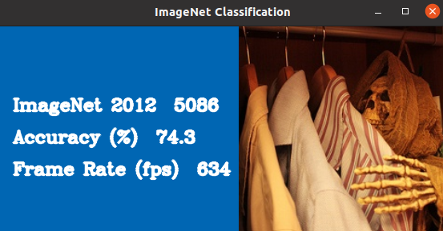
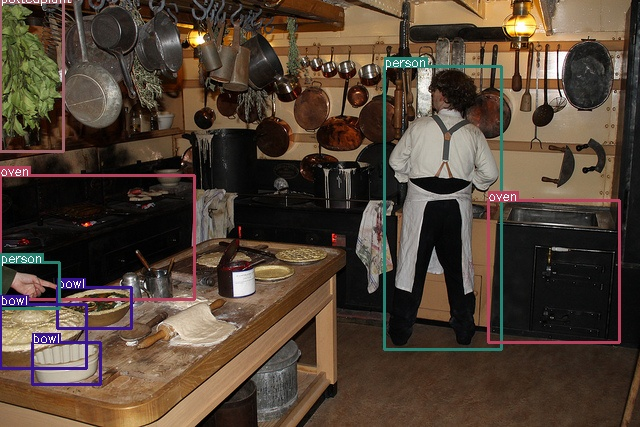
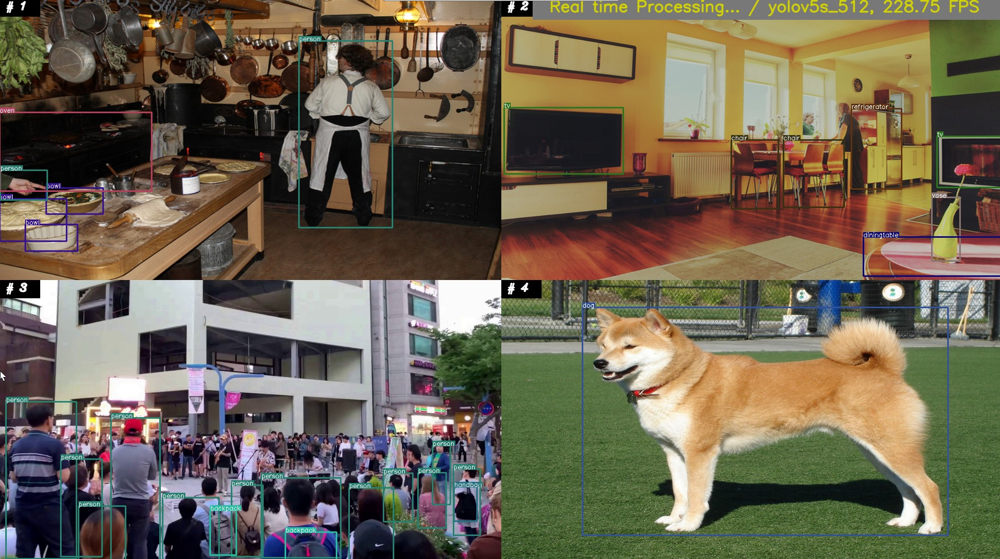
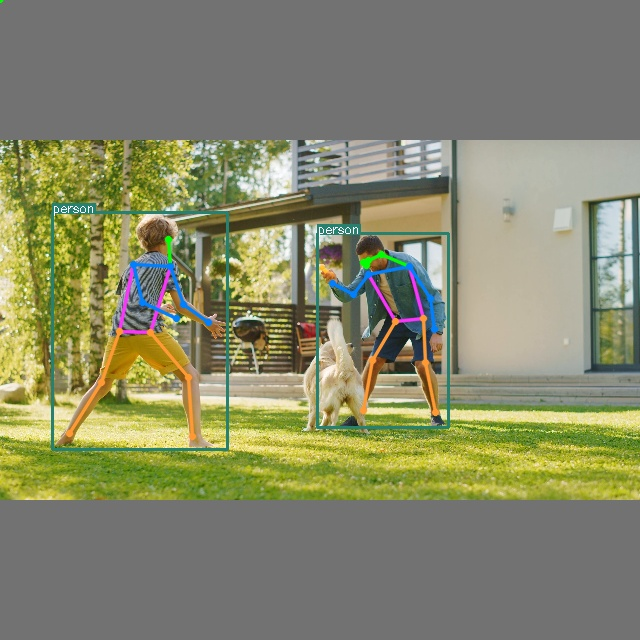
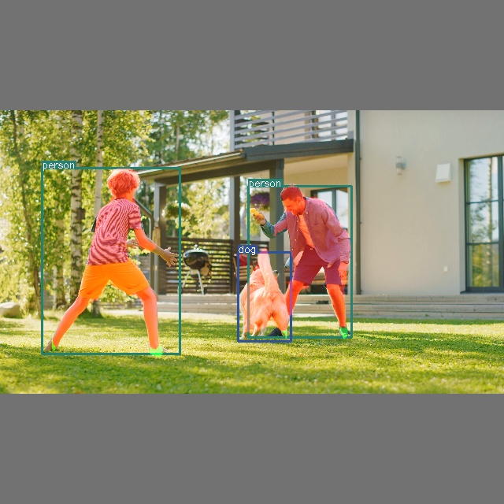

## DX-APP (DXNN V2)    

**DX-APP** is DEEPX User's Application Templates based on DEEPX devices.    
This is an application examples that gives you a quick experience of NPU Accelerator performance.     
You can refer to **DX-APP** and modify it a little or implement application depending on the purpose of your use.       
This can reduce stress, such as setting the environment and implementing the code.    
Application performance may also depending on the specifications of the host CPU because it includes pre/post processing and graphics processing operations.           


## C++ Demo Applications    

### prerequisites    
- Set up build Environment ([Link](https://github.com/DEEPX-AI/dx_rt/blob/main/docs/Installation.md))     
- Install dxrt library and driver ([Link](https://github.com/DEEPX-AI/dx_rt/blob/main/docs/Getting-Started.md))     
- model compiled for DEEPX's NPU chips ([Link](https://deepx.ai/model-zoo/))   

You can also refer to the installation guide, [Here](../README.md#Installation)

### Build DX-APP    
- **Build Application**          
  ```shell
  ./build.sh 
  ```
  If you want a clean build, use the **--clean** option.          
  ```shell
  ./build.sh --clean
  ```
  To specify the compilation environment as arm64 or riscv64, use the **--arch** option.     
  ```shell
  ./build.sh --arch arm64
  # or
  # ./build.sh --arch riscv64
  ```            
  After the build is successfully completed, demo and templates will be installed on the <U>\<your dx-app path\>/bin/</U>.

### Classification Demo       
- Basic Classification ([classification.cpp](classification/classification.cpp)) [Try Demo](#Run-Classification)  
- ImageNet Classification ([imagenet_classification.cpp](classification/imagenet_classification.cpp)) [Try Demo](#Run-Classification)     
                       
### Object Detection Demo    
- Yolo Object Detection ([yolo_demo.cpp](object_detection/yolo_demo.cpp)) [Try Demo](#Run-Object-Detection)    
- Yolo Object Detection - Multi Channel ([yolo_demo_multi.cpp](object_detection/yolo_demo_multi.cpp)) [Try Demo](#Run-Object-Detection)     
- SSD Object Detection ([ssd_demo.cpp](object_detection/ssd_demo.cpp))    
                       
### Pose Estimation Demo        
- Human Pose Estimation ([pose_demo.cpp](pose_estimation/pose_demo.cpp)) [Try Demo](#Run-Pose-Estimation)      
- Human Pose Estimation + Semantic Segmentation ([pose_ddrnet.cpp](pose_estimation/pose_ddrnet.cpp)) [Try Demo](#Run-Pose-Estimation)      

### Segmentation Demo        
- Semantic Segmentation DDRNet (Human Only) ([ddrnet.cpp](segmentation/ddrnet.cpp)) [Try Demo](#Run-Segmentation)     
- Semantic Segmentation DDRNet (Human Only) + Yolo Object Detection ([yolo_ddrnet.cpp](object_det_and_seg/yolo_ddrnet.cpp)) [Try Demo](#Run-Segmentation)     
- Semantic Segmentation PIDNet (CityScape dataset Only) ([pidnet.cpp](segmentation/pidnet.cpp))    
- Semantic Segmentation PIDNet (CityScape dataset Only) + Yolo Object Detection ([yolo_pidnet.cpp](object_det_and_seg/yolo_pidnet.cpp))         


## Run the Demo Executable    
**Getting the usage of executable, Try run with "-h" option.**

### Run Classification     
  - **Classification**       
    ```shell 
    $ sudo ./bin/classification -m example/EfficientNetB0_4/graph.dxnn -i example/ILSVRC2012/0.jpeg
    ...
    Top1 Result : class 831
    ```             
  - **ImageNet Classification** 
    ```shell
    $ sudo ./bin/imagenet_classification -m example/EfficientNetB0_4/graph.dxnn -i example/imagenet_val_map.txt -p example/ILSVRC2012/
    ```
    <p align="center">
      
    </p>

### Run Object Detection      
  - **Yolo Object Detection**       
    Example excutable for yolov5s_512 model.
    
    ```shell 
    $ sudo ./bin/yolo -m example/YOLOV5S_3/graph.dxnn -i sample/1.jpg -p 1
    ...
      Detected 8 boxes.
        BBOX:person(0) 0.859366, (307.501, 138.443, 400.977, 364.696)
        BBOX:oven(69) 0.661055, (-0.446404, 225.652, 155.377, 325.085)
        BBOX:bowl(45) 0.564862, (46.2462, 314.978, 105.182, 347.728)
        BBOX:person(0) 0.561198, (0.643028, 295.378, 47.8478, 331.855)
        BBOX:oven(69) 0.494507, (390.414, 245.532, 495.489, 359.54)
        BBOX:bowl(45) 0.47086, (-0.300865, 328.801, 69.139, 379.72)
        BBOX:bowl(45) 0.452027, (25.9788, 359.192, 80.7059, 392.734)
        BBOX:pottedplant(58) 0.368497, (0.423544, 86.835, 51.0048, 206.592)
    ```             
    <p align="center">
      
    </p>           

    Yolo Object Detection applications requires pre/post processing parameters that are not included in the compiled model. 
    Example paramters are describes in yolo_cfg.cpp and are all listed in yolo_demo.cpp as follows :     
    ```cpp
    // pre/post parameter table
    YoloParam yoloParams[] = {
        [0] = yolov5s_320,
        [1] = yolov5s_512,             // ----> p option : 1
        [2] = yolov5s_640,
        [3] = yolov5s_512_concat,
        [4] = yolox_s_512,
        [5] = yolov7_640,
        [6] = yolov7_512,
        [7] = yolov4_608,
        [8] = yolov5s_640_ppu,
    };
    ```    
    To configure your own parameters, simply modify the examples or add new examples to the list and yolo_cfg.cpp.    
    This is Example config for yolov5s_512 model.
    ```c
    YoloParam yolov5s_512 = {
        .height = 512,
        .width = 512,
        .confThreshold = 0.25,
        .scoreThreshold = 0.3,
        .iouThreshold = 0.4,
        .numBoxes = -1,
        .numClasses = 80,
        .layers = {
            {
                .numGridX = 64,
                .numGridY = 64,
                .numBoxes = 3,
                .anchorWidth = { 10.0, 16.0, 33.0 },
                .anchorHeight = { 13.0, 30.0, 23.0 },
                .tensorIdx = { 0 },
            },
            .
            .
            .
        },
        .classNames = {"person" ,"bicycle" ,"car" ,"motorcycle", . . .}
    };
    ```
    
  - **Yolo Multi Channel Object Detection**    
    Example excutable for yolov5s_512 model.     

    ```shell
    $ sudo ./bin/yolo_multi -c ./example/4ch.json
    ```     

    <p align="center">
      
    </p>           

    As like above yolo model list, You need to modify or create a json config file. 
    The example json file is located in [sample/test_od_demo.json](../sample/test_od_demo.json) and must be modified for use. 
    Refer to following configuration json file.      

    ```json
    {
        "usage": "multi",
          "model_path": "/model_path/yolov5s_512",
          "model_name": "yolov5s_512",
          
          "video_sources": [
                          ["/video_path/video_sample0.mp4", "realtime"],
                          ["/dev/video0", "camera"],
                          ["/image_path/image.jpg", "image"],
                          ["/video_path/video_sample1.mp4", "offline", 400]
          ], 
          
          "display_config": {
                          "display_label": "output",
                          "capture_period": 33,
                          "output_width": 1920,
                          "output_height": 1080,
                          "show_fps": true
          }
    }

    ```
    Set "model_name" for mapping pre/post processing parameters.
    ```c
    YoloParam getYoloParameter(string model_name){
        if(model_name == "yolov5s_320")
            return yolov5s_320;
        else if(model_name == "yolov5s_512")
            return yolov5s_512;
        else if(model_name == "yolov5s_640")
            return yolov5s_640;
        else if(model_name == "yolov5s_512_concat")
            return yolov5s_512_concat;
        else if(model_name == "yolox_s_512")
            return yolox_s_512;
        else if(model_name == "yolov7_640")
            return yolov7_640;
        else if(model_name == "yolov7_512")
            return yolov7_512;
        else if(model_name == "yolov4_608")
            return yolov4_608;
        return yolov5s_512;
    }
    ```
    
### Run Pose Estimation      
  - **Pose Estimation**       
    This project was produced with reference to Ultralytics yolo pose model.         
    Example excutable for yolo pose model. **(Pose model will be included in a later release)**      
    ```shell
    $ sudo ./bin/pose -m /your-yolo-pose-model-path/graph.dxnn -i sample/1.jpg -p 0
    ```     
    
    <p align="center">
      
    </p>            

    The dxrt model has input and output tensors that shapes are N H W C format by default. Output tensor data format of current devices is aligned on 64-byte.    
    For example, **[1, 40, 52, 36]** will be **[1, 52, 36, 40 + 24]** output tensor which is with 24 bytes of dummy.       

    ```text
        inputs
          images, INT8, [1, 640, 640, 3,  ], 0
        outputs
          /0/model.33/m_kpt.0/Conv_output_0, FLOAT, [1, 80, 80, 192,  ], 0 ----> Key points per 3 anchor boxes
          /0/model.33/m.0/Conv_output_0, FLOAT, [1, 80, 80, 64,  ], 0      ----> Object Box Info 
          /0/model.33/m_kpt.1/Conv_output_0, FLOAT, [1, 40, 40, 192,  ], 0
          /0/model.33/m.1/Conv_output_0, FLOAT, [1, 40, 40, 64,  ], 0
          /0/model.33/m_kpt.2/Conv_output_0, FLOAT, [1, 20, 20, 192,  ], 0
          /0/model.33/m.2/Conv_output_0, FLOAT, [1, 20, 20, 64,  ], 0
          /0/model.33/m_kpt.3/Conv_output_0, FLOAT, [1, 10, 10, 192,  ], 0
          /0/model.33/m.3/Conv_output_0, FLOAT, [1, 10, 10, 64,  ], 0
    ```

    Yolo Pose applications requires pre/post processing parameters that are not included in the compiled model. 
    Example paramters are describes in pose_estimation/yolo_cfg.cpp and are all listed in pose_demo.cpp as follows :     
    
    ```c
    // pre/post parameter table
    YoloParam yoloParams[] = {
        [0] = yolov5s6_pose_640,         // ----> p option : 0
        [1] = yolov5s6_pose_1280
    };
    ```     
    
  - **Pose Estimation with Segmentation**       
    Example excutable for yolo pose and segmentation model.    
    This segmentation model masks only on humans. And It separates the body from the feet.     

    ```shell
    $ sudo ./bin/pose_ddrnet -m /your-yolo-pose-model-path/graph.dxnn -s /your-segmentation-model-path/graph.dxnn -i sample/7.jpg -p 0
    ```     
    
    <p align="center">
      
    </p>            
  

### Run Segmentation       
  - **Semantic Segmentation DDRNet**       
    This project was produced with reference to DDRNet model.         
    Example excutable for semantic segmentation model. This segmentation model masks only on humans. And It separates the body from the feet.   
    
    ```shell
    $ sudo ./bin/ddrnet -m /your-segmentation-model-path/graph.dxnn -i sample/7.jpg
    ```     
    <p align="center">
      
    </p>            

    As you can see from the code block below, this model masks the human figure. And It separates the body from the feet.    

    ```c
    /* class_index, class_name, colorB, G, R */
    SegmentationParam segCfg[] = {
        {0, "background" , 0, 0   , 0,    },
        {1, "foot"       , 0, 128 , 0,    },
        {2, "body"       , 0, 0   , 128,  },
    };
    ```

    If the model trained with cityscape dataset, a segmentation config may be generated by referring to below. 
    And We are planning to release the segmentation model, the BiSeNet model, in the future.  
    
    ```c
    /* class_index, class_name, colorB, G, R */
    SegmentationParam segCfg[] = {
        {	0	  ,	"road"          ,	128	,	64	,	128	,	},
        {	1	  ,	"sidewalk"      ,	244	,	35	,	232	,	},
        {	2	  ,	"building"      ,	70	,	70	,	70	,	},
        {	3	  ,	"wall"          ,	102	,	102	,	156	,	},
        {	4	  ,	"fence"         ,	190	,	153	,	153	,	},
        {	5	  ,	"pole"          ,	153	,	153	,	153	,	},
        {	6	  ,	"traffic light" ,	51	,	255	,	255	,	},
        {	7	  ,	"traffic sign"  ,	220	,	220	,	0	,	},
        {	8	  ,	"vegetation"    ,	107	,	142	,	35	,	},
        {	9	  ,	"terrain"       ,	152	,	251	,	152	,	},
        {	10	,	"sky"           ,	255	,	0	  ,	0	,	},
        {	11	,	"person"        ,	0	  ,	51	,	255	,	},
        {	12	,	"rider"         ,	255	,	0	  ,	0	,	},
        {	13	,	"car"           ,	255	,	51	,	0	,	},
        {	14	,	"truck"         ,	255	,	51	,	0	,	},
        {	15	,	"bus"           ,	255	,	51	,	0	,	},
        {	16	,	"train"         ,	0	  ,	80	,	100	,	},
        {	17	,	"motorcycle"    ,	0	  ,	0	  ,	230	,	},
        {	18	,	"bicycle"       ,	119	,	11	,	32	,	},
    };
    ```
    
  - **Semantic Segmentation DDRNet with Object Detection**       
    This project was produced with reference to DDRNet and yolov5 models.      
    
    ```shell
    $ sudo ./bin/od_ddr -m0 example/YOLOV5S_3/graph.dxnn -m1 /your-segmentation-model-path/graph.dxnn -i sample/7.jpg
    ```     
    <p align="center">
      
    </p>            

    