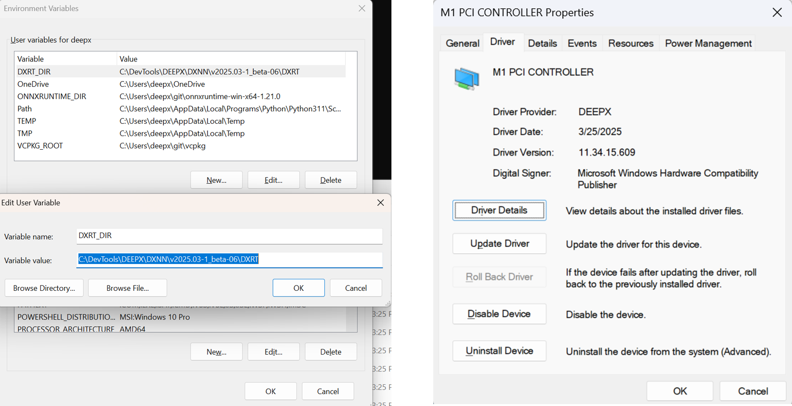
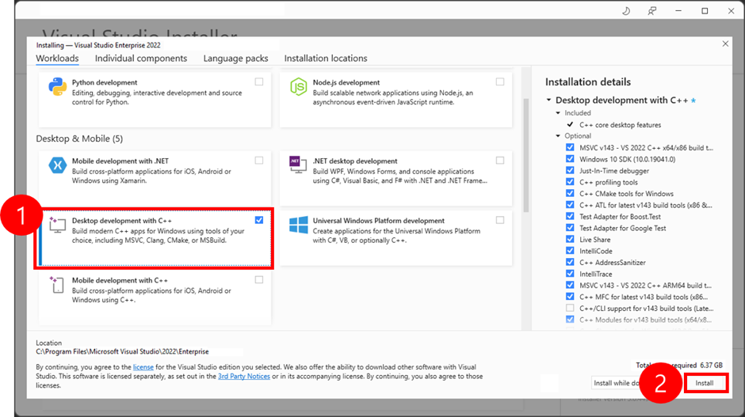
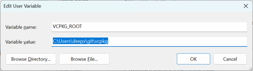
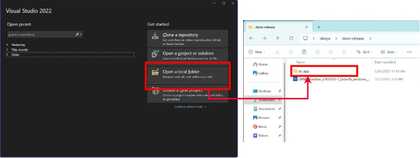
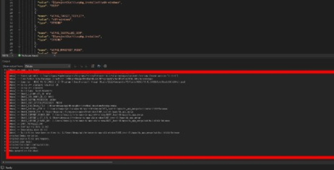
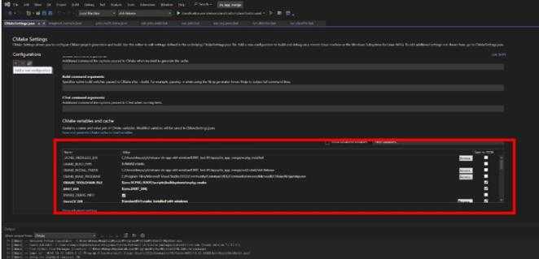
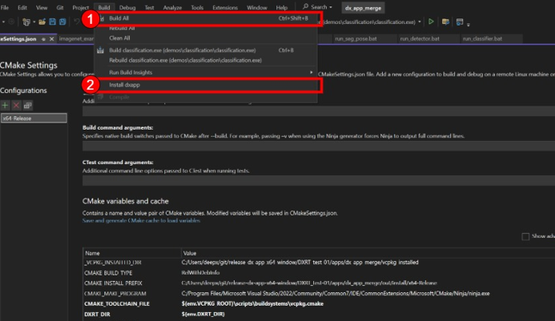
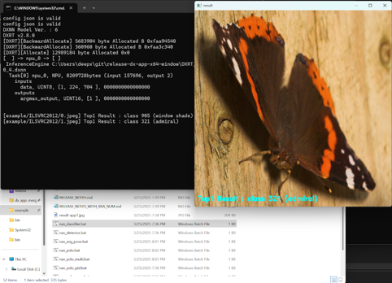

## Installation dxrt and M1 windows driver

Windows supports the following versions (or later):

- dx_rt: v2.8.0
- M1 Driver: 11.34.15.609

To install these components, simply run the included installer:

```shell
DXNN_Runtime_v2025.03-1_beta-06_windows_amd64.exe
```

By default, `dx_rt` is installed in:

```cmake
C:\DevTools\DEEPX\DXNN\v2025.03-1_beta-06\DXRT
```

If you add the installation path to the PATH environment variable as `DXRT_DIR`,

you can use `dx_app/CMakeSettings.json` without any modifications.

The M1 Device Driver will be installed with version **11.34.15.609**.



## Install visual Studio community 2022

Created with reference to the following link. : 
[Visual Studio 2022 installation](https://learn.microsoft.com/en-us/cpp/build/vscpp-step-0-installation?view=msvc-170)

- Download Visual Studio Community 2022 from : [Download Visual Studio](https://visualstudio.microsoft.com/ko/vs/community/)

- Open Visual Studio Installer 

- Choose workload : “Desktop development with C++”   
   After you choose the other workloads and optional components you want, run Install.



## Install VCPKG (Optional)

If you are using Visual Studio 2022, you do not need to install VCPKG separately, as it is included by default in Visual Studio

**Manual Installation Steps**

- Download vcpkg from : [vcpkg repository](https://github.com/microsoft/vcpkg)

- Open a Command Prompt

- Run the following command 
```shell
.\bootstrap-vcpkg.bat
```

- Add VCPKG to the system environment variable `PATH`

- Add the User's environment variable "VCPKG_ROOT"
  


## Build and Install dx-app in Visual Studio 2022

- **Visual Studio 2022 open project -> "Open a local folder" -> select the `dx_app` folder**
  


- **Dependencies will be automatically installed in the **vcpkg_installed** folder through the **vcpkg.json** file, and CMake configureation will be completed.**
  


- **(optional) Modify CMakeSettings.json**
  
If needed, you can manually configure `DXRT_DIR` and `OpenCV_DIR` in CMakeSettings.json.
  
```json
{
   "name": "CMAKE_TOOLCHAIN_FILE",
   "value": "${env.VCPKG_ROOT}\\scripts\\buildsystems\\vcpkg.cmake",
   "type": "STRING"
},
{
   "name": "DXRT_DIR",
   "value": "C:\\DevTools\\DEEPX\\DXNN\\v2025.03-1_beta-06\\DXRT",
   "type": "STRING"
},
{
   "name": "OpenCV_DIR",
   "value": "${projectDir}\\vcpkg_installed\\x64-windows",
   "type": "STRING"
},
```

- **Register Libraries in the `PATH` Variable**
  
To run the application, ensure that the modified libraries and binaries are registered in the `PATH` environment variable.

Note: By default, `DXRT_DIR` is set as ${env.DXRT_DIR}.
Since *dx_app/vcpkg.json* is included, OpenCV will be automatically installed in the *vcpkg_installed/x64-windows* directory when configuring CMake in Visual Studio.



- **Build and Install**

The executable will be generated under the `bin` folder.

Build -> Build All (or Rebuild All) -> Install dxapp




## Run Example Demo Executable files On Windows

When you run `setup.bat`, the models and videos files will be created under the `assets` folder.
The models include Classification, Object Detection, and Segmentation models.
Various dx_app demos have been created using batch files.

When installing OpenCV via `vcpkg`, it will be installed in the *vcpkg_installed/x64-windows* directory, and the corresponding `PATH` is included in the batch file.
For custom OpenCV installations, you must include the path either in the Windows user environment variable `PATH` or directly in the batch script.

After the build and installation are complete, the executable files will be installed in the bin folder.
You can run the batch files to experience the demo.

- run_classifier.bat

```bat
@echo off
setlocal

set "OPENCV_LIB_PATH=%~dp0\vcpkg_installed\x64-windows\lib\"
set "OPENCV_DLL_PATH=%~dp0\vcpkg_installed\x64-windows\bin\"
set PATH=%OPENCV_LIB_PATH%;%OPENCV_DLL_PATH%;%PATH%
set "APP_JSON_PATH=%~dp0\example\imagenet_example.json"

start cmd /K "%~dp0\bin\run_classifier.exe" -c %APP_JSON_PATH%

endlocal
```

If the user has not added a custom OpenCV installation to the `PATH`, they must modify `OPENCV_LIB_PATH` and `OPENCV_DLL_PATH` in the batch file.


