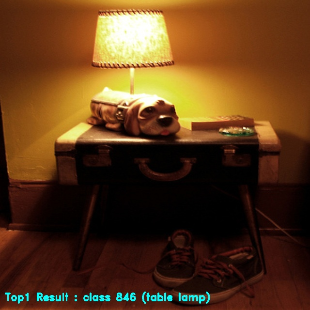
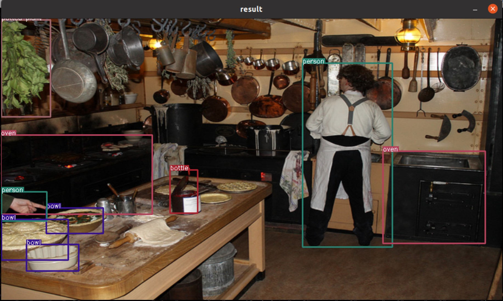
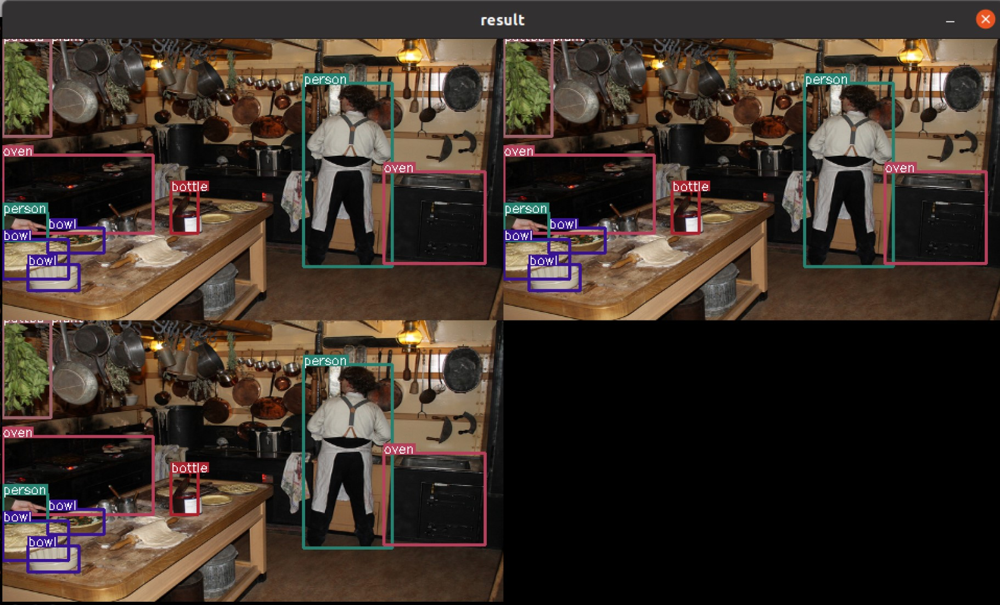

Application Template is that makes it easy to experience classification or object detection through json config file modification.

The only part that needs to be modified is json config file.

If the yolo decoding method requires customization, you only need to modify the yoloCustomDecode part of *lib/utils/box_decode.hpp*.

Currently, This template only supports detection in the yolo method.

## Run Application Temaplates

- [Classification](./Classification-Template-Guide.md)

- [Object Detection](./Object-Detection-Template-Guide.md)

- [Python Examples](./Python-Example-Guide.md)

**Getting the usage of executable, Try run with "-h" option.**

If you want to see the output image and content, insert the `"type"` to `"realtime"` in the example json file and run it.

### Run Classification Template

- **Classification**

```shell
./bin/run_classifier -c example/imagenet_example.json
  ...
  [example/ILSVRC2012/0.jpeg] Top1 Result : class 831 (studio couch, day bed)
  [example/ILSVRC2012/1.jpeg] Top1 Result : class 321 (admiral)
  [example/ILSVRC2012/2.jpeg] Top1 Result : class 846 (table lamp)
  [example/ILSVRC2012/3.jpeg] Top1 Result : class 794 (shower curtain)
```

*example/imagenet_example.json* is a json config file that can run the classification model. Referring to this, you can customizing input and output.
And You can modify it in the application section for displaying or save classification results.

```json
"application": {
    "description": "result of post-processing after inference, you can use \"save\" or \"realtime\" or \"none\"",
    "type": "save"
}
```

For a detailed explanation of how classification works, refer to [Classification-Template-Guide.md](./Classification-Template-Guide.md).




### Run Detection Template

- **Detection**

```shell
./bin/run_detector -c example/yolov5s3_example.json
  ...
  detected : 9
```

*example/yolov5s3_example.json* is a json config file that can run the detection model. Referring to this, you can customizing input and output.

And You can modify it in the application section for displaying or save detection results.

```json
"application": {
    "description": "result of post-processing after inference, you can use \"save\" or \"realtime\" or \"none\"",
    "type": "realtime"
}
```

If "type" is "save," the output is saved as a video file. If "type" is "realtime," the output is displayed on the screen. If "type" is "none," the count of detection results is continuously printed.  
The current example json file has the "type" set to "none." If you want to save the output, change it to "save."



When using the yolo model, the post processing parameters can be modified to suit the use by referring to official yolov5 model.
And You can also modify classes information.
You don't have to revise only the json config file to recompile the code.  
The "yolo_basic" method uses the decoding approach from YOLOv3, YOLOv5, YOLOv7. Other methods include "yolo_scale," "yolox," "yolo_pose," and "scrfd."

Please refer to follow json config file.

```json
"model":{
    "path":"assets/models/YOLOV5S_3.dxnn",
    "param":{
        "name":"yolov5s_512",
        "score_threshold":0.25,
        "iou_threshold":0.3,
        "last_activation":"sigmoid",
        "decoding_method":"yolo_basic",
        "box_format":"center",
        "layer":[
            {
            "name":"2", "stride": 8,
            "anchor_width": [10, 16, 33],
            "anchor_height": [13, 30, 23]
            },
            {
            "name":"1", "stride": 16,
            "anchor_width": [30, 62, 59],
            "anchor_height": [61, 45, 119]
            },
            {
            "name":"0", "stride": 32,
            "anchor_width": [116, 156, 373],
            "anchor_height": [90, 198, 326]
            }
        ]
    }
}
```

And it supports multi-channel detection.
You can experience multi-channel detection in the form of a checkerboard by writing the image, video, and camera device path in the sources list of the input section.

When the "type" is "video," you can specify the number of frames. This allows for pre-processing and inference on the specified number of frames in the video.

```json
"input":{
    "format":"RGB",
    "sources":[
            {
                "type":"image", "path":"/your-sample-image-path/1.jpg"
            },
            {
                "type":"video", "path":"/your-sample-video-path/1.mp4"
            },
            {
                "type":"video", "path":"/your-sample-video-path/1.mp4", "frames":100
            },
            {
                "type":"camera", "path":"/dev/video0"
            }
    ]
},
```



And If you use a cutomized yolo model instead of the official yolo model, or If you don't use the basic yolo decoding method,
You have to write a decode function yourself. You can also refer to the yoloXDecode in the box_decode.hpp.
Write your own decode function by analyzing the following code block.  
The code block below is located in path *lib/utils/box_decode.hpp*.

```cpp
dxapp::common::BBox yoloCustomDecode(std::function<float(float)> activation, std::vector<float*> datas, dxapp::common::Point grid, dxapp::common::Size anchor, int stride, float scale)
{
    /**
      * @brief adding your decode method
      *
      * example code ..
      *      float* data = datas[0];
      *      dxapp::common::BBox box_temp;
      *      box_temp._xmin = (activation(data[0]) * 2. - 0.5 + grid._x ) * stride; //center x
      *      box_temp._ymin = (activation(data[1]) * 2. - 0.5 + grid._y ) * stride; //center y
      *      box_temp._width = std::pow((activation(data[2]) * 2.f), 2) * anchor._width;
      *      box_temp._height = std::pow((activation(data[3]) * 2.f), 2) * anchor._height;
      *      dxapp::common::BBox result = {
      *              ._xmin=box_temp._xmin - box_temp._width / 2.f,
      *              ._ymin=box_temp._ymin - box_temp._height / 2.f,
      *              ._xmax=box_temp._xmin + box_temp._width / 2.f,
      *              ._ymax=box_temp._ymin + box_temp._height / 2.f,
      *              ._width = box_temp._width,
      *              ._height = box_temp._height,
      *      };
      *
      */

    dxapp::common::BBox result;

    return result;
};
```

As you know, if you modify the code, you have to re-compile it.

```shell
./build.sh
```

For a detailed explanation of how to write your models' custom post processing, refer to [Object-Detection-Template-Guide.md](./Object-Detection-Template-Guide.md).
