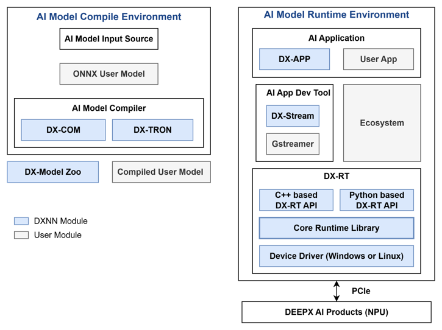

This chapter provides an overview of the DEEPX SDK architecture and explains each core component, and describes the overview and key features of DX-APP. 

## DEEPX SDK Architecture  


**DEEPX SDK** is an all-in-one software development platform that streamlines the process of compiling, optimizing, simulating, and deploying AI inference applications on DEEPX NPUs (Neural Processing Units). It provides a complete toolchain, from AI model creation to runtime deployment, optimized for edge and embedded systems, enabling developers to build high-performance AI applications with minimal effort.  

**DX-COM** is the compiler in the DEEPX SDK that converts a pre-trained ONNX model and its associated configuration JSON file into a hardware-optimized .dxnn binary for DEEPX NPUs. The ONNX file contains the model structure and weights, while the JSON file defines pre/post-processing settings and compilation parameters. DX-COM provides a fully compiled .dxnn file, optimized for low-latency and high-efficient inference on DEEPX NPU.  

**DX-RT** is the runtime software responsible for executing ,dxnn models on DEEPX NPU hardware. DX-RT directly interacts with the DEEPX NPU through firmware and device drivers, using PCIe interface for high-speed data transfer between the host and the NPU, and provides C/C++ and Python APIs for application-level inference control. DX-RT offers a complete runtime environment, including model loading, I/O buffer management, inference execution, and real-time hardware monitoring.  

**DX ModelZoo** is a curated collection of pre-trained neural network models optimized for DEEPX NPU, designed to simplify AI development for DEEPX users. It includes pre-trained ONNX models, configuration JSON files, and pre-compiled DXNN binaries, allowing developers to rapidly test and deploy applications. DX ModelZoo also provides benchmark tools for comparing the performance of quantized INT8 models on DEEPX NPU with full-precision FP32 models on CPU or GPU.  

**DX-STREAM** is a custom GStreamer plugin that enables real-time streaming data integration into AI inference applications on DEEPX NPU. It provides a modular pipeline framework with configurable elements for preprocessing, inference, and postprocessing, tailored to vision AI work. DX-Stream allows developers to build flexible, high-performance applications for use cases such as video analytics, smart cameras, and edge AI systems.  

**DX-APP** is a collection of "per-model examples" that run compiled models on DEEPX NPUs via DX-RT. It ships runnable examples for key vision tasks—object detection, face recognition, image classification—and shares common processing logic so you can copy and lightly modify what you need. DX-APP helps you stand up the runtime quickly and serves as a practical starting point for building and customizing your own applications. Below are representative run examples.   

---

## DX-APP Features

**DX-APP** provides ready-to-use examples for image classification, object detection, segmentation, and pose estimation.

You can quickly evaluate inference capabilities without modifying the source code and easily adapt the templates for custom applications. These templates significantly reduce the overhead of environment configuration and manual implementation.

!!! note "NOTE" 

    Application performance may vary depending on host system specifications. Each demo includes pre-processing, post-processing, and graphics processing operations.


### Example Catalog

**DX-APP** examples are optimized to showcase pre-compiled models on DEEPX NPUs with minimal setup. Each example demo represents a common AI task and can be executed using images, videos, or live camera input.

**Classification (EfficientNetB0)**  

- Input: image (e.g., `224x224`) / Output: Top-1 class
- Example run
```bash
./bin/efficientnet_async -m ./assets/models/EfficientNetB0_4.dxnn -i ./sample/ILSVRC2012/0.jpeg -l 1
./bin/efficientnet_sync  -m ./assets/models/EfficientNetB0_4.dxnn -i ./sample/ILSVRC2012/0.jpeg -l 1
```

**Object Detection (YOLOv8N)**  

- Input: image/video/camera/RTSP / Output: boxes rendered and logged
- Example run
```bash
./bin/yolov8_async -m ./assets/models/YoloV8N.dxnn -i ./sample/img/1.jpg --no-display -l 1
./bin/yolov8_sync  -m ./assets/models/YoloV8N.dxnn -i ./sample/img/1.jpg --no-display -l 1 -s
```

**Face Detection (SCRFD)**  

- Input: image / Output: face boxes, landmarks, log
- Example run
```bash
./bin/scrfd_async -m ./assets/models/SCRFD500M_1.dxnn -i ./sample/img/face_sample.jpg --no-display -l 1
./bin/scrfd_sync  -m ./assets/models/SCRFD500M_1.dxnn -i ./sample/img/face_sample.jpg --no-display -l 1 -s
```

**Pose Estimation (YOLOv5 Pose)**  

- Input: image/video/camera / Output: person boxes + keypoints
- Example run
```bash
./bin/yolov5pose_async -m ./assets/models/YOLOV5Pose640_1.dxnn -i ./sample/img/1.jpg --no-display -l 1
./bin/yolov5pose_sync  -m ./assets/models/YOLOV5Pose640_1.dxnn -i ./sample/img/1.jpg --no-display -l 1 -s
```

**Segmentation (DeepLabV3+)**  

- Input: image/video/camera / Output: boxes + masks rendered, results saved
- Example run
```bash
./bin/deeplabv3_async -m ./assets/models/DeepLabV3PlusMobileNetV2_2.dxnn -i ./sample/img/8.jpg --no-display -l 1
./bin/deeplabv3_sync  -m ./assets/models/DeepLabV3PlusMobileNetV2_2.dxnn -i ./sample/img/8.jpg --no-display -l 1 -s
```

**Composite (Object Detection x Semantic Segmentation)**  

- Input: image/video/camera / Output: detection boxes plus segmentation masks rendered together
- Example run
```bash
./bin/yolov7_x_deeplabv3_async -m ./assets/models/YoloV7.dxnn,./assets/models/DeepLabV3PlusMobileNetV2_2.dxnn -i ./sample/img/1.jpg --no-display -l 1
./bin/yolov7_x_deeplabv3_sync  -m ./assets/models/YoloV7.dxnn,./assets/models/DeepLabV3PlusMobileNetV2_2.dxnn -i ./sample/img/1.jpg --no-display -l 1 -s
```

---
