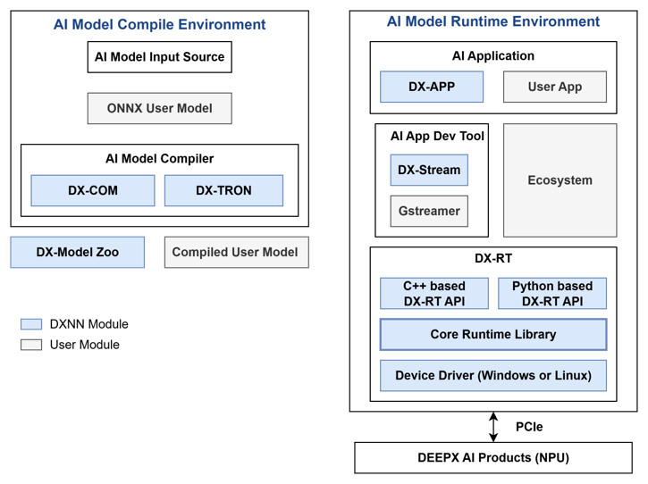

# DXNN Application Overview

## DEEPX SDK Architecture  


**DEEPX SDK** is an all-in-one software development platform that streamlines the process of compiling, optimizing, simulating, and deploying AI inference applications on DEEPX NPUs (Neural Processing Units). It provides a complete toolchain, from AI model creation to runtime deployment, optimized for edge and embedded systems, enabling developers to build high-performance AI applications with minimal effort.  

**DX-COM** is the compiler in the DEEPX SDK that converts a pre-trained ONNX model and its associated configuration JSON file into a hardware-optimized .dxnn binary for DEEPX NPUs. The ONNX file contains the model structure and weights, while the JSON file defines pre/post-processing settings and compilation parameters. DX-COM provides a fully compiled .dxnn file, optimized for low-latency and high-efficient inference on DEEPX NPU.  

**DX-RT** is the runtime software responsible for executing .dxnn models on DEEPX NPU hardware. DX-RT directly interacts with the DEEPX NPU through firmware and device drivers, using PCIe interface for high-speed data transfer between the host and the NPU, and provides C/C++ and Python APIs for application-level inference control. DX-RT offers a complete runtime environment, including model loading, I/O buffer management, inference execution, and real-time hardware monitoring.  

**DX ModelZoo** is a curated collection of pre-trained neural network models optimized for DEEPX NPU, designed to simplify AI development for DEEPX users. It includes pre-trained ONNX models, configuration JSON files, and pre-compiled DXNN binaries, allowing developers to rapidly test and deploy applications. DX ModelZoo also provides benchmark tools for comparing the performance of quantized INT8 models on DEEPX NPU with full-precision FP32 models on CPU or GPU.  

**DX-STREAM** is a custom GStreamer plugin that enables real-time streaming data integration into AI inference applications on DEEPX NPU. It provides a modular pipeline framework with configurable elements for preprocessing, inference, and postprocessing, tailored to vision AI work. DX-Stream allows developers to build flexible, high-performance applications for use cases such as video analytics, smart cameras, and edge AI systems.  

**DX-APP** is a collection of runnable example applications that execute compiled models on DEEPX NPUs through DX-RT. It provides examples across 17 AI task categories including classification, object detection, face detection, pose estimation, semantic/instance segmentation, depth estimation, OBB detection, embedding, image denoising, enhancement, super resolution, hand landmark detection, attribute recognition, person re-identification, and face alignment. The current DX-APP repository is organized around refactored `src/cpp_example/` and `src/python_example/` trees, each with their own shared runtime layer (`common/`) providing base interfaces, processors, runners, visualizers, and utilities via a factory pattern. Additionally, `src/postprocess/` provides C++ post-processing consumed by pybind11 bindings for `*_cpp_postprocess.py` variants. DX-APP is intended both as a quick-start runtime package for users and as a reusable application baseline for further customization. Below are representative run examples.   

---

## DX-APP Features

**DX-APP** provides ready-to-use examples for image classification, object detection, segmentation, pose estimation, and related inference tasks.

You can quickly evaluate inference capabilities without modifying the source code and then expand toward task- and model-specific customization. The current example set is backed by a refactored source layout, shared post-processing modules, and a [DX-ModelZoo](https://developer.deepx.ai/modelzoo/)-based asset preparation flow.

!!! note "NOTE"  
    Application performance may vary depending on host system specifications. Each demo includes pre-processing, post-processing, and graphics processing operations.

!!! note "Related Guides"
    For installation and build steps, refer to [DX-APP Installation and Build](02_DX-APP_Installation_and_Build.md). For C++ and Python example usage details, refer to [DX-APP C++ Usage Guide](03_DX-APP_CPP_Example_Usage_Guide.md) and [DX-APP Python Usage Guide](05_DX-APP_Python_Example_Usage_Guide.md).

### Example Catalog

**DX-APP** examples are optimized to showcase pre-compiled models on DEEPX NPUs with minimal setup. Assets are prepared through the standard setup flow, and representative examples can be executed using images, videos, or live camera input.

**Classification (EfficientNet-Lite0)**  

- Input: image (e.g., `224x224`)  
- Output: Top-1 class  
- Example run  
```bash
./bin/efficientnet_lite0_async -m ./assets/models/EfficientNet_Lite0.dxnn -i ./sample/ILSVRC2012/0.jpeg -l 1
./bin/efficientnet_lite0_sync  -m ./assets/models/EfficientNet_Lite0.dxnn -i ./sample/ILSVRC2012/0.jpeg -l 1
```

**Object Detection (YOLOv8N)**  

- Input: image/video/camera/RTSP  
- Output: boxes rendered and logged  
- Example run  
```bash
./bin/yolov8n_async -m ./assets/models/YoloV8N.dxnn -i ./sample/img/sample_kitchen.jpg --no-display -l 1
./bin/yolov8n_sync  -m ./assets/models/YoloV8N.dxnn -i ./sample/img/sample_kitchen.jpg --no-display -l 1 -s
```

**Face Detection (SCRFD)**  

- Input: image  
- Output: face boxes, landmarks, log  
- Example run  
```bash
./bin/scrfd500m_async -m ./assets/models/SCRFD500M.dxnn -i ./sample/img/sample_face.jpg --no-display -l 1
./bin/scrfd500m_sync  -m ./assets/models/SCRFD500M.dxnn -i ./sample/img/sample_face.jpg --no-display -l 1 -s
```

**Pose Estimation (YOLOv8s Pose)**  

- Input: image/video/camera  
- Output: person boxes + keypoints  
- Example run  
```bash
./bin/yolov8s_pose_async -m ./assets/models/yolov8s_pose.dxnn -i ./sample/img/sample_kitchen.jpg --no-display -l 1
./bin/yolov8s_pose_sync  -m ./assets/models/yolov8s_pose.dxnn -i ./sample/img/sample_kitchen.jpg --no-display -l 1 -s
```

**Segmentation (DeepLabV3+)**  

- Input: image/video/camera  
- Output: boxes + masks rendered, results saved  
- Example run  
```bash
./bin/deeplabv3plusmobilenet_async -m ./assets/models/DeepLabV3PlusMobilenet.dxnn -i ./sample/img/sample_parking.jpg --no-display -l 1
./bin/deeplabv3plusmobilenet_sync  -m ./assets/models/DeepLabV3PlusMobilenet.dxnn -i ./sample/img/sample_parking.jpg --no-display -l 1 -s
```

**Semantic Segmentation (BiSeNetV1)**  

- Input: image/video/camera  
- Output: segmentation masks rendered  
- Example run  
```bash
./bin/bisenetv1_async -m ./assets/models/BiSeNetV1.dxnn -i ./sample/img/sample_parking.jpg --no-display -l 1
./bin/bisenetv1_sync  -m ./assets/models/BiSeNetV1.dxnn -i ./sample/img/sample_parking.jpg --no-display -l 1 -s
```

---

## DX-APP Core Design & Capabilities

DX-APP is engineered to maximize NPU throughput while minimizing CPU-side bottlenecks.  

### Unified Post-Processing Engine

To ensure consistency and speed, all model-specific decoding (NMS, box scaling, mask generation) is implemented in optimized C++ libraries.  

- **Cross-Language Parity:** These modules are exposed to Python via `pybind11` (`dx_postprocess`), ensuring Python developers achieve C++-level performance.  
- **Logic Standardization:** Identical decoding logic across both environments guarantees consistent inference results.  

### Execution Paradigms: Sync vs. Async

Templates are provided in two variants to help developers optimize for their specific use cases  

- **Synchronous (Sync):** Sequential execution (**Pre → Inference → Post**). Best for single-image analysis and simplified debugging.  
- **Asynchronous (Async):** A multi-threaded design using `RunAsync()` to overlap stages. While the NPU processes Frame **N**, the CPU prepares Frame **N+1** and post-processes Frame **N-1**. This is critical for maximizing **FPS** on real-time video or RTSP streams.  

### Performance Profiling & Bottleneck Analysis

Every application template in DX-APP—regardless of the language (C++/Python) or execution paradigm (Sync/Async)—is equipped with a built-in performance profiler. Upon completion, the console outputs a **Performance Summary** that serves as a critical tool for application tuning.  

**Key Metrics Collected**  

- **Stage Latency:** Precise timing for each stage of the pipeline  
      : **Pre-processing:** Image decoding, resizing, and normalization  
      : **NPU Inference:** Pure execution time on the DEEPX NPU via DX-RT  
      : **Post-processing:** Result decoding (NMS, box scaling, etc.)  
      : **Display/I/O:** Time taken to render or save the output  
- **End-to-End Throughput (FPS):** The overall frames per second achieved by the entire system.  

**Strategic Objectives**  

- **Bottleneck Identification:** Instantly determine if the system is limited by CPU-side tasks (Pre/Post-processing) or NPU throughput. For instance, if post-processing latency is high in a Python script, you can strategically switch to the **C++ Binding** (`dx_postprocess`) variant.  
- **Architectural Benchmarking:** Quantitatively validate how much performance is gained by moving from a **Synchronous** to an **Asynchronous** design.  
- **Resource Optimization:** Help developers balance NPU utilization and CPU overhead to find the "sweet spot" for their specific hardware and commercial use case.  
 
---
