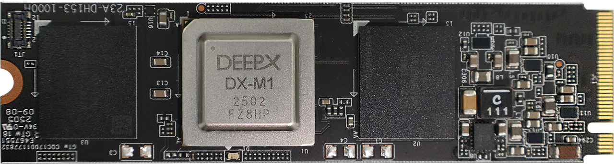

This chapter describes the system requirements and the installation instructions on Linux and WIndows to use **DX-APP**.

## System Requirements

This section describes the hardware and software requirements for running **DX-APP**.

**Hardware  Requirements**  

- **CPU:** amd64(x86_64), aarch64(arm64)
- **RAM:** 8GB RAM (16GB RAM or higher is recommended)
- **Storage:** 4GB or higher available disk space
- The system **must** support connection to an **M1 M.2** module with the M.2 interface on the host PC. 

{ width=700px }


**Note.** The **NPU Device Driver** and **DX-RT Library must** be installed. Refer to **DX-RT User Manual** for step-by-step installation instructions.  

---

## Installation on Linux

This section describes the software requirements and installation steps for setting up **DX-APP** on Ubuntu-based systems.

### Software Requirements on Linux  

To run **DX-APP** on Linux, the following components **must** be installed.  

- **OS**: Ubuntu 18.04 / 20.04 / 22.04 / 24.04 (x64)  
- **Deepx M1 Driver Version**: v1.7.1 or higher  
- **Deepx M1 Runtime Lib Version**: v3.0.0 or higher  

All required components are included in the **DXNN All Suite (DX-AS)** package.  


### Prerequisites Setup

**1. Install DX-RT Device Driver**  
To set up the build Environment, refer to **Section. Linux Device Driver Installation** in **DX-RT User Manual**.  

Once the DX-RT device driver is installed, the system should include both the PCIe driver and the runtime driver.  You can verify the installation by checking the loaded kernel modules.  

```
lsmod | grep dx

# dxrt_driver 53248 2
# dx_dma 475136 7 dxrt_driver
```

**2. Install DX-RT Library**   
To install the DX-RT library and NPU device driver, refer to **Section. Build Guide for Cross-compile** in **SDX-RT User Manual**.  

Once **DX-RT** is built, the runtime library and header files are installed in the following directory.  

- Libraries: `/usr/local/lib`  
- Headers: `/usr/local/include`  

```
set(DXRT_INSTALLED_DIR /usr/local)
```

If necessary, you can modify the installation path by editing `cmake/toolchain.x86_64.cmake`.  


### DX-APP Application Setup  

**1. DX-APP Installation Options**  
You can check the available **DX-APP** installation options by running the following command. 

```
./install.sh # --help
```
You can view more installation options by entering the `--help` flag.

**2. OpenCV Installation Options**  
If you want to enable CPU/GPU acceleration, OpenCV **must** be manually installed on your system.  
During the OpenCV build process, setting the following flags are needed.  

- `TBB=ON, IPP=ON, CUDA=ON`

If OpenCV is already installed, manually set the `OpenCV_DIR` path in your toolchain file.
```
set(CMAKE_SYSTEM_NAME Linux)
set(CMAKE_SYSTEM_PROCESSOR x86_64)
set(DXRT_INSTALLED_DIR /usr/local)
set(OpenCV_DIR /your/opencv/installation/dir)
set(onnxruntime_LIB_DIRS /usr/local/lib)
```

**3. Build and Run DX-APP**  
To build `dx_app`, run the following command. 
```
./build.sh ## Use --clean for a clean build
```

To download required models and sample videos, run the following command.  
```
./setup.sh
```

Assets are downloaded and placed in the `assets/` directory. The available assets include models for Classification, Object Detection, and Segmentation.  

To test `dx_app`, run the following command.  
```
./scripts/run_detector.sh
```
You can also use the `run_demo.sh` script to conveniently run a variety of demo applications included with DX-APP. This script provides an interactive menu that allows you to quickly test different AI models and features without needing to remember or type out complex command-line arguments.

To use the demo launcher, simply execute the following command in your terminal:

```
./run_demo.sh
  0: Object Detection (YOLOv7)
  1: Object Detection (YOLOv8N)
  2: Object Detection (YOLOv9S)
  3: Face Detection (YOLOV5S_Face)
  4: Pose Estimation
  5: Semantic Segmentation
  6: Multi-Channel Object Detection (YOLOv5)
  7: Multi-Model Object Detection (YOLOv5) & Segmentation
which AI demo do you want to run:(timeout:10s, default:0)
```

**4. Resolve Shared Library Errors**  
If you encounter shared library errors (e.g., `libdxrt.so`), update the system’s library cache. 
```
# Copy your library to /usr/local/lib
sudo cp your_library.so /usr/local/lib

# Update the system's library cache
sudo ldconfig
```
---
