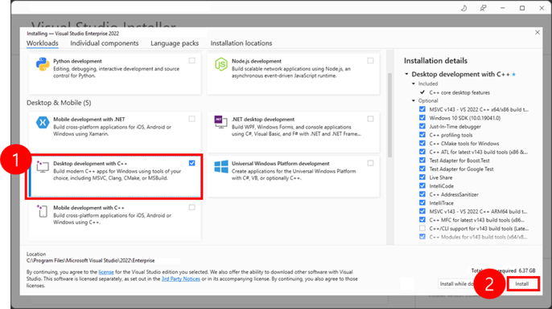
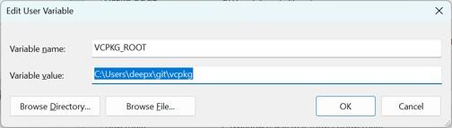
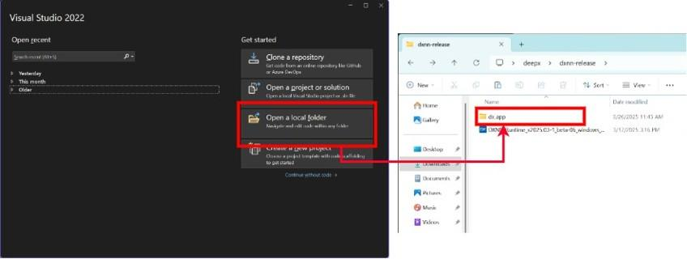
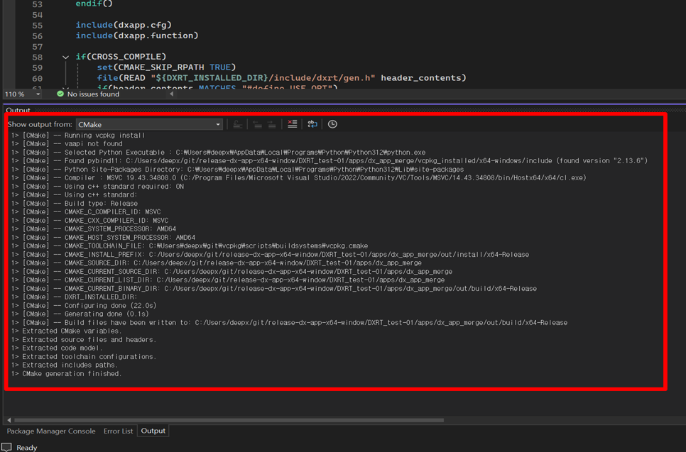
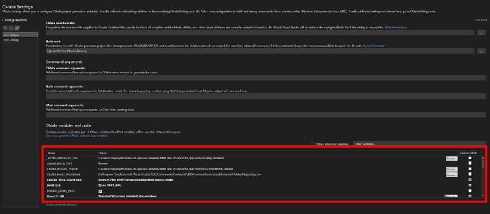
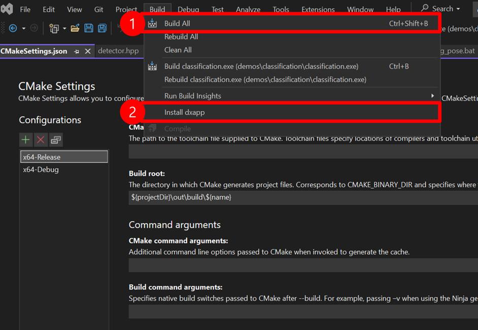

This chapter describes the system requirements and the installation instructions on Linux and WIndows to use **DX-APP**.

---

## System Requirements

This section describes the hardware and software requirements for running **DX-APP**.

**Hardware  Requirements**

- **CPU:** amd64(x86_64), aarch64(arm64)
- **RAM:** 8GB RAM (16GB RAM or higher is recommended)
- **Storage:** 4GB or higher available disk space
- The system **must** support connection to an **M1 M.2** module with the M.2 interface on the host PC. 


!!! note "NOTE" 

    The **NPU Device Driver** and **DX-RT Library must** be installed. Refer to **DX-RT User Manual** for step-by-step installation instructions.  

---

## Installation on Linux

This section describes the software requirements and installation steps for setting up **DX-APP** on Ubuntu-based and Debian-based systems.

### Software Requirements on Linux  

To run **DX-APP** on Linux, the following components **must** be installed.  

- **OS**: Ubuntu 18.04 / 20.04 / 22.04 / 24.04 (x64) and Debian 12 / Debian 13 (x64)
- **Deepx M1 Driver Version**: v1.7.1 or higher
- **Deepx M1 Runtime Lib Version**: v3.0.0 or higher

All required components are included in the **DXNN All Suite (DX-AS)** package.  


### Prerequisites Setup

**1. Install DX-RT Device Driver**  
To set up the build Environment, refer to **Section. Linux Device Driver Installation** in **DX-RT User Manual**.  

Once the DX-RT device driver is installed, the system should include both the PCIe driver and the runtime driver.  You can verify the installation by checking the loaded kernel modules.  

```
lsmod | grep dx

# dxrt_driver 53248 2
# dx_dma 475136 7 dxrt_driver
```

**2. Install DX-RT Library**   
To install the DX-RT library and NPU device driver, refer to **Section. Build Guide for Cross-compile** in **SDX-RT User Manual**.  

Once **DX-RT** is built, the runtime library and header files are installed in the following directory.  

- Libraries: `/usr/local/lib`  
- Headers: `/usr/local/include`  

```
set(DXRT_INSTALLED_DIR /usr/local)
```

If necessary, you can modify the installation path by editing `cmake/toolchain.x86_64.cmake`.  


### DX-APP Application Setup  

**1. DX-APP Installation Options**  
You can check the available **DX-APP** installation options by running the following command. 

```
./install.sh # --help
```
You can view more installation options by entering the `--help` flag.

**2. OpenCV Installation Options**  
If you want to enable CPU/GPU acceleration, OpenCV **must** be manually installed on your system.  
During the OpenCV build process, setting the following flags are needed.  

- `TBB=ON, IPP=ON, CUDA=ON`

If OpenCV is already installed, manually set the `OpenCV_DIR` path in your toolchain file.
```
set(CMAKE_SYSTEM_NAME Linux)
set(CMAKE_SYSTEM_PROCESSOR x86_64)
set(DXRT_INSTALLED_DIR /usr/local)
set(OpenCV_DIR /your/opencv/installation/dir)
set(onnxruntime_LIB_DIRS /usr/local/lib)
```

**3. Build and Run DX-APP**  
To build `dx_app`, run the following command. 
```
./build.sh ## Use --clean for a clean build
```

To download required models and sample videos, run the following command.  
```
./setup.sh
```

Assets are downloaded and placed in the `assets/` directory. The available assets include models for Classification, Object Detection, and Segmentation.  

**Post-Processing Unit (PPU) Acceleration Integration**

DX-APP utilizes PPU Acceleration to maximize inference efficiency on NPU hardware.

The PPU is engineered to offload computationally intensive post-processing tasks, specifically bounding box decoding and score thresholding, directly to the NPU. This critical architectural shift mitigates the CPU overhead traditionally incurred during post-processing, leading to a substantial enhancement in overall inference throughput.

**Key Operational Benefits**

-	Improved Processing Speed: Achieved by enabling the parallel execution of both the core inference and the post-processing operations.
-	Enhanced Throughput: Provides a significant advantage for real-time applications that require sustained high frame rates.

**PPU-Enabled Demo Options:**

- Option 1: Object Detection With PPU (YoloV7-640)
- Option 4: Object Detection With PPU (YOLOv5S-512)
- Option 6: Face Detection With PPU (SCRFD500M-640)  
- Option 8: Pose Estimation With PPU (YOLOv5Pose-640)

**4. Resolve Shared Library Errors**  
If you encounter shared library errors (e.g., `libdxrt.so`), update the system’s library cache. 
```
# Copy your library to /usr/local/lib
sudo cp your_library.so /usr/local/lib

# Update the system's library cache
sudo ldconfig
```
---

## Installation on Windows  

This section details the software requirements and sequential installation steps necessary for setting up the DX-APP environment on Windows systems.

- Stage 1: Prerequisites - Verify system requirements 
- Stage 2: Core Runtime - Install the official DX-RT and M1 Driver 
- Stage 3: Toolchain - Install Visual Studio 2022 (C++ compiler/build environment).
- Stage 4: Build & Install - Compile DX-APP source code using build.bat or the VS IDE.


### Software Requirements on Windows  

To run **DX-APP** on Windows, the following components **must** be installed.  

- **OS**: Windows 10 or later  
- **Python**: Version 3.8 or higher (required for Python module support)  
- **Compiler**: Visual Studio Community 2022 (required for building C++ examples)  


### Install DX-RT and M1 Windows Driver  
   
DEEPX provides an official Windows installer for **DXNN Runtime (DX-RT)**, which includes the required runtime libraries and M1 device driver.

**Prerequisite checklist (DX-RT Windows Driver)**

- Microsoft Visual C++ 2015-2022 Redistributable (x64) 
- DEEPX NPU device (e.g., DX-M1) connected via PCIe slot, M.2 slot, or USB 4.0 (USB4 PCIe tunneling required)
- Administrator privileges for driver installation

Visual Studio Community 2022 is the build toolchain (IDE + compiler), while the Microsoft Visual C++ 2015-2022 Redistributable provides the runtime DLLs needed to run the built apps.

For detailed instructions, refer to [DeepX NPU Windows Runtime & Driver](https://github.com/DEEPX-AI/dx_rt_windows).


### Install Visual Studio Community 2022  

To use **DX-APP** on Windows, Visual Studio Community 2022 **must** be installed with appropriate development tools.

**Installation Step**  

- **Step 1.** Download Visual Studio Community 2022  
- **Step 2.** Launch the installer and select the following workload  
  : Desktop development with C++  
- **Step 3.** (Optional) Select additional workloads or individual components as needed  
- **Step 4.** Click **Install** to begin the installation process  



!!! note "NOTE" 

    Visual Studio Community 2022 is required; other versions are not tested.  


### Install VCPKG  

VCPKG is a C++ package manager used for handling third-party dependencies like OpenCV.

!!! note "NOTE" 

    If you are using Visual Studio Community 2022, **VCPKG is pre-installed**. and no separate installation is necessary. 

If manual installation is required, follow the steps below.  

- **1.** Download the vcpkg package from GitHub  
- **2.** Open **Command Prompt** and Run the following command  
- **3.** Set the user variables  
  : Variable Name: `VCPKG_ROOT`  
  : Variable Value: Path to your vcpkg installation directory  

!!! note "NOTE" 

    This step is essential to allow Visual Studio to automatically detect and use VCPKG-managed packages like OpenCV.  




### Build and Install dx_app in Visual Studio Community 2022  

To build and run the `dx_app` application on Windows, follow the steps below using Visual Studio Community 2022.  

**Step 1. Open Project Folder**  

- **Step 1.** Launch Visual Studio Community 2022
- **Step 2.** From the start screen, select **Open a local folder**  
- **Step 3.** Navigate to and select the `dx_app` project folder

!!! note "IMPORTANT" 

    You must use Visual Studio 2022. Support for other versions (VS 2019, VS Code, etc.) has not been tested and compatibility cannot be guaranteed.   



**Step 2. Project Configuration**  
Upon opening the project,  

- Dependencies specified in `vcpkg.json` will be automatically downloaded and installed into the `vcpkg_installed` directory.  
- CMake will automatically generate the build cache and configuration.  



**Step 3. (Optional) Edit CMakeSettings**  
If needed, you can manually specify the following environment variables in `CMakeSettings.json`.  

- `DXRT_DIR`: Path to the installed DX-RT runtime  
- `OpenCV_DIR`: Path to the OpenCV installation (if manually installed)  

```
{
    "name": "CMAKE_TOOLCHAIN_FILE",
    "value": "${env.VCPKG_ROOT}/scripts/buildsystems/vcpkg.cmake",
    "type": "STRING"
},
{
    "name": "DXRT_DIR",
    "value": "path/to/dx_rt/installed",
    "type": "STRING"
},
{
    "name": "OpenCV_DIR",
    "value": "${projectDir}/vcpkg_installed/x64-windows/share/opencv",
    "type": "STRING"
}
```

**Step 4. Register `PATH` Variable**  
Ensure the required runtime libraries are accessible with the system’s `PATH` environment variable.  

- `DXRT_DIR` is referenced in CMAKE as `${env.DXRT_DIR}`.

!!! note "NOTE" 

    If you are using `dx_app/vcpkg.json`, OpenCV will be automatically downloaded and installed into `vcpkg_installed/x64-windows` directory during CMake configuration step. 




**Step 5. Build and Install `dx_app`**  
To build and install the dx_app application:

- **Step 5-1.** Go to the **Build** menu  
- **Step 5-2.** Click **Build All** (or **Rebuild All**) to begin the build process  

Upon successful compilation, the application executable will be generated under the `bin/` directory.




### Alternative Build Method: Using build.bat (generates build_internal.bat)

The updated `build.bat` now generates `build_internal.bat` from `CMakeSettings.json` and drives both the DX-APP build and the pybind C++ module build.

**Key behaviors**

- Generates `build_internal.bat` based on the selected CMake configuration (toolchain, paths, generator).
- Validates environment (e.g., `DXRT_DIR`) and cleans stale CMake cache to avoid generator/toolset mismatches.
- Builds and installs DX-APP executables/libraries, then builds the pybind C++ module.

**Prerequisites**

- `DXRT_DIR` set to the DX-RT installation directory
- Visual Studio 2022 with Desktop development with C++ workload
- CMake available in `PATH`

**Usage**

From the project root:
```
build.bat
```

`build_internal.bat` is written alongside, then executed to configure, build, and install outputs. Use the generated `dxapp.sln` (under the build directory, ./out/build/x64-Release/) if you want to open in Visual Studio 2022 for further development.

**Visual Studio solution Generation**  

After successful execution of build.bat, the scripts generates the necessary solution files for development within the IDE.

- **[IMPORTANT]** Open Solution: Open the generated solution file at `out\build\x64-Release\dxapp.sln`  **using Visual Studio 2022**
(NOTE. Opening with other versions may cause compatibility issues or build failures.)
- **Access & Customization**: Use Visual Studio 2022 for debugging, development, and further customization. All project targets and configurations are accessible through the VS 2022 interface.

**Build Output Structure:**

```
dx_app/
├── out/                   # Build directory created by build.bat
│   ├── build/             # CMake build files
│   │   ├── x64-Release/   # Release build configuration
│   │   │   ├── dxapp.sln  # Visual Studio 2022 solution file
│   │   │   ├── *.vcxproj  # Project files for each target
│   │   │   └── ...        # Other build artifacts
│   │   └── ...
│   └── install/           # Installation directory
├── bin/                   # Installed executables
└── lib/                   # Installed libraries
```

### Run Example Executable Files On Windows  

After building and installing dx_app, you can execute the demo applications using provided batch scripts.  

**Step 1. Execute `setup.bat`**  

Run the `setup.bat` script to automatically download all required models and sample videos.  

- The downloaded assets will be placed in the `assets` folder.  
- The assets include models for Classification, Object Detection, and Segmentation.  

**Step 2. Run Examples**  

You can run the examples using the same command line instructions as in Linux, but using the `.exe` extension for executables.

- classification example:
```shell
./bin/efficientnet_async.exe -m ./assets/models/EfficientNetB0_4.dxnn -i ./sample/ILSVRC2012/0.jpeg 
```
- object detection example:
```shell
./bin/yolov8_sync.exe  -m ./assets/models/YoloV8N.dxnn -i ./sample/img/1.jpg -l 10
```
