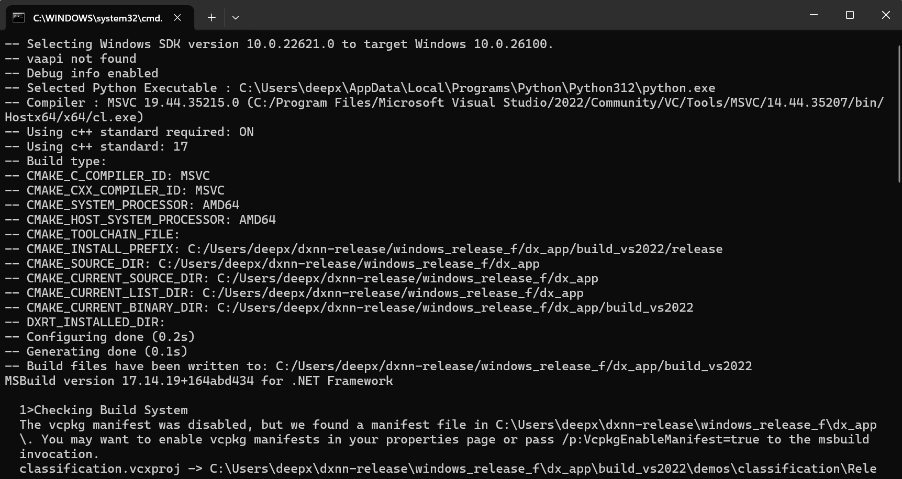
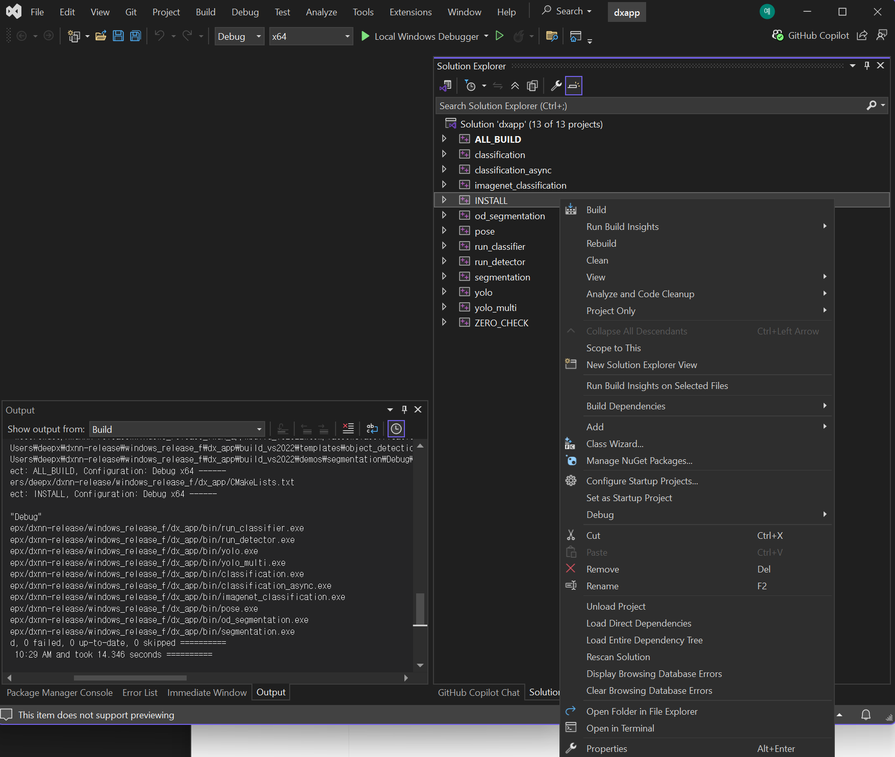
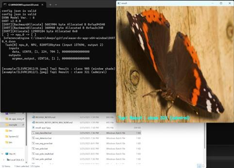

This chapter describes the system requirements and the installation instructions on Linux and WIndows to use **DX-APP**.

## System Requirements

This section describes the hardware and software requirements for running **DX-APP**.

**Hardware  Requirements**
- **CPU:** amd64(x86_64), aarch64(arm64)
- **RAM:** 8GB RAM (16GB RAM or higher is recommended)
- **Storage:** 4GB or higher available disk space
- The system **must** support connection to an **M1 M.2** module with the M.2 interface on the host PC. 


**Note.** The **NPU Device Driver** and **DX-RT Library must** be installed. Refer to **DX-RT User Manual** for step-by-step installation instructions.  

---

## Installation on Linux

This section describes the software requirements and installation steps for setting up **DX-APP** on Ubuntu-based systems.

### Software Requirements on Linux  

To run **DX-APP** on Linux, the following components **must** be installed.  

- **OS**: Ubuntu 18.04 / 20.04 / 22.04 / 24.04 (x64)  
- **Deepx M1 Driver Version**: v1.7.1 or higher  
- **Deepx M1 Runtime Lib Version**: v3.0.0 or higher  

All required components are included in the **DXNN All Suite (DX-AS)** package.  


### Prerequisites Setup

**1. Install DX-RT Device Driver**  
To set up the build Environment, refer to **Section. Linux Device Driver Installation** in **DX-RT User Manual**.  

Once the DX-RT device driver is installed, the system should include both the PCIe driver and the runtime driver.  You can verify the installation by checking the loaded kernel modules.  

```
lsmod | grep dx

# dxrt_driver 53248 2
# dx_dma 475136 7 dxrt_driver
```

**2. Install DX-RT Library**   
To install the DX-RT library and NPU device driver, refer to **Section. Build Guide for Cross-compile** in **SDX-RT User Manual**.  

Once **DX-RT** is built, the runtime library and header files are installed in the following directory.  

- Libraries: `/usr/local/lib`  
- Headers: `/usr/local/include`  

```
set(DXRT_INSTALLED_DIR /usr/local)
```

If necessary, you can modify the installation path by editing `cmake/toolchain.x86_64.cmake`.  


### DX-APP Application Setup  

**1. DX-APP Installation Options**  
You can check the available **DX-APP** installation options by running the following command. 

```
./install.sh # --help
```
You can view more installation options by entering the `--help` flag.

**2. OpenCV Installation Options**  
If you want to enable CPU/GPU acceleration, OpenCV **must** be manually installed on your system.  
During the OpenCV build process, setting the following flags are needed.  

- `TBB=ON, IPP=ON, CUDA=ON`

If OpenCV is already installed, manually set the `OpenCV_DIR` path in your toolchain file.
```
set(CMAKE_SYSTEM_NAME Linux)
set(CMAKE_SYSTEM_PROCESSOR x86_64)
set(DXRT_INSTALLED_DIR /usr/local)
set(OpenCV_DIR /your/opencv/installation/dir)
set(onnxruntime_LIB_DIRS /usr/local/lib)
```

**3. Build and Run DX-APP**  
To build `dx_app`, run the following command. 
```
./build.sh ## Use --clean for a clean build
```

To download required models and sample videos, run the following command.  
```
./setup.sh
```

Assets are downloaded and placed in the `assets/` directory. The available assets include models for Classification, Object Detection, and Segmentation.  

To test `dx_app`, run the following command.  
```
./scripts/run_detector.sh
```
You can also use the `run_demo.sh` script to conveniently run a variety of demo applications included with DX-APP. This script provides an interactive menu that allows you to quickly test different AI models and features without needing to remember or type out complex command-line arguments.

To use the demo launcher, simply execute the following command in your terminal:

```
./run_demo.sh
  0: Object Detection (YOLOv7)
  1: Object Detection (YOLOv8N)
  2: Object Detection (YOLOv9S)
  3: Object Detection With PPU (YOLOv5S-320)
  4: Face Detection (YOLOV5S_Face)
  5: Face Detection With PPU (SCRFD500M-640)
  6: Pose Estimation
  7: Pose Estimation With PPU (YOLOv5Pose-640)
  8: Semantic Segmentation
  9: Multi-Channel Object Detection (YOLOv5)
  10: Multi-Channel Object Detection With PPU (YOLOv5-320)
  11: Multi-Model Object Detection (YOLOv5) & Segmentation
  which AI demo do you want to run:(timeout:10s, default:0)
```

**Post-Processing Unit (PPU) Acceleration**

"PPU" stands for Post Processing Unit acceleration, which handles bounding box decoding and score thresholding functions directly on the NPU hardware instead of the CPU. This approach significantly improves inference performance by reducing CPU overhead that occurs during post-processing on the CPU.

**Key Benefits of PPU:**
- Improved Processing Speed: Parallel execution of inference and post-processing operations
- Enhanced Throughput: Particularly beneficial for real-time applications requiring high frame rates

**PPU-Enabled Demo Options:**
- Option 3: Object Detection With PPU (YOLOv5S-320)
- Option 5: Face Detection With PPU (SCRFD500M-640)  
- Option 7: Pose Estimation With PPU (YOLOv5Pose-640)
- Option 10: Multi-Channel Object Detection With PPU (YOLOv5-320)

**4. Resolve Shared Library Errors**  
If you encounter shared library errors (e.g., `libdxrt.so`), update the system’s library cache. 
```
# Copy your library to /usr/local/lib
sudo cp your_library.so /usr/local/lib

# Update the system's library cache
sudo ldconfig
```
---

## Installation on Windows  

This section describes the software requirements and installation steps for setting up **DX-APP** on Windows systems.

### Software Requirements on Windows  

To run **DX-APP** on Windows, the following components **must** be installed.  

- **OS**: Windows 10 / 11  
- **Deepx M1 Driver Version**: v1.7.1 or higher  
- **Deepx M1 Runtime Lib Version**: v3.0.0 or higher
- **Python**: Version 3.8 or higher (required for Python module support)  
- **Compiler**: Visual Studio Community 2022 (required for building C++ examples)  


### Install DX-RT and M1 Windows Device Driver  
   
DEEPX provides an official Windows installer for **DXNN Runtime (DX-RT)**, which includes the required runtime libraries and M1 device driver.

For detailed instructions, refer to [DX-RT Framework & Windows Device Driver Installation Guide](https://github.com/DEEPX-AI/dx_rt/blob/main/docs/docs/03_Installation_on_Windows.md).


### Install Visual Studio Community 2022  

To use **DX-APP** on Windows, Visual Studio Community 2022 **must** be installed with appropriate development tools.

**Installation Step**  

- **1.** Download Visual Studio Community 2022  
- **2.** Launch the installer and select the following workload  
  : Desktop development with C++  
- **3.** (Optional) Select additional workloads or individual components as needed  
- **4.** Click **Install** to begin the installation process  


**Note.** If Visual Studio Community 2022 is **not** installed, you may be prompted to install the **Microsoft Visual C++ Redistributable** (`VC_redist.x64.exe`) with administrator permissions.  


### (Optional) Install VCPKG  

VCPKG is a C++ package manager used for handling third-party dependencies like OpenCV.

**Note.** If you are using Visual Studio Community 2022, **VCPKG is pre-installed**. and no separate installation is necessary. 

If manual installation is required, follow the steps below.  

- **1.** Download the vcpkg package from GitHub  
- **2.** Open **Command Prompt** and Run the following command  
- **3.** Set the user variables  
  : Variable Name: `VCPKG_ROOT`  
  : Variable Value: Path to your vcpkg installation directory  

**Note.** This step is essential to allow Visual Studio to automatically detect and use VCPKG-managed packages like OpenCV.  


### Build and Install dx_app in Visual Studio Community 2022  

To build and run the `dx_app` application on Windows, follow the steps below using Visual Studio Community 2022.  

**Step 1. Open Project Folder**  

- **1.** Launch Visual Studio Community 2022
- **2.** From the start screen, select **Open a local folder**  
- **3.** Navigate to and select the `dx_app` project folder

**IMPORTANT:** You must use Visual Studio 2022. Other versions (VS 2019, VS Code, etc.) are not supported.   


**Step 2. Project Configuration**  
Upon opening the project,  

- Dependencies specified in `vcpkg.json` will be automatically downloaded and installed into the `vcpkg_installed` directory.  
- CMake will automatically generate the build cache and configuration.  


**Step 3. (Optional) Edit CMakeSettings**  
If needed, you can manually specify the following environment variables in `CMakeSettings.json`.  

- `DXRT_DIR`: Path to the installed DX-RT runtime  
- `OpenCV_DIR`: Path to the OpenCV installation (if manually installed)  

```
{
    "name": "CMAKE_TOOLCHAIN_FILE",
    "value": "${env.VCPKG_ROOT}\\scripts\\buildsystems\\vcpkg.cmake",
    "type": "STRING"
},
{
    "name": "DXRT_DIR",
    "value": "C:\\DevTools\\DEEPX\\DXNN\\v2025.03-1_beta-06\\DXRT",
    "type": "STRING"
},
{
    "name": "OpenCV_DIR",
    "value": "${projectDir}\\vcpkg_installed\\x64-windows",
    "type": "STRING"
}
```

**Step 4. Register `PATH` Variable**  
Ensure the required runtime libraries are accessible with the system’s `PATH` environment variable.  

- `DXRT_DIR` is referenced in CMAKE as `${env.DXRT_DIR}`.

**Note.** If you are using `dx_app/vcpkg.json`, OpenCV will be automatically downloaded and installed into `vcpkg_installed/x64-windows` directory during CMake configuration step. 


**Step 5. Build and Install `dx_app`**  
To build and install the dx_app application:

- **1.** Go to the **Build** menu  
- **2.** Click **Build All** (or **Rebuild All**) to begin the build process  

Upon successful compilation, the application executable will be generated under the `bin/` directory.


### Alternative Build Method: Using build.bat Script

For users who prefer a more automated approach, **DX-APP** provides a `build.bat` script that streamlines the entire build process. This script automatically handles CMake configuration, build, and installation steps.

**Key Features of build.bat:**

- **Automated Build Process**: Handles the complete build pipeline from configuration to installation
- **Environment Validation**: Automatically checks for required environment variables (`DXRT_DIR`) 
- **Visual Studio 2022 Integration**: Generates Visual Studio 2022 solution files for development
- **Organized Build Structure**: Creates builds in the `build_vs2022` directory for clean organization
- **Release Configuration**: Builds and installs in optimize1d Release mode
- **Error Handling**: Comprehensive error checking at each build stage

**Prerequisites:**

- **DXRT_DIR Environment Variable**: Must be set to DX-RT installation directory
- **Visual Studio 2022**: With Desktop development with C++ workload
- **CMake**: Accessible from command line

**Using build.bat:**

**Step 1. Run the Build Script**  
Execute the build script from the project root directory:
```
build.bat
```

**Step 2. Build Process Overview**  
The script performs the following operations automatically:


1. **Environment Validation**: Verifies that `DXRT_DIR` is set and the directory exists
2. **Build Directory Creation**: Creates `build_vs2022` directory if it doesn't exist
3. **CMake Configuration**: Configures the project using Visual Studio 2022 generator with x64 architecture
4. **Solution Generation**: Creates `dxapp.sln` in the `build_vs2022` directory 
5. **Release Build**: Compiles the project in Release configuration
6. **Installation**: Installs the built binaries to the appropriate directories

**Step 3. Visual Studio Integration**  
After successful execution, you can:

- **IMPORTANT**: Open the generated solution file at `build_vs2022\dxapp.sln` **using Visual Studio 2022**
- Use Visual Studio 2022 for debugging, development, and further customization
- Access all project targets and configurations through the Visual Studio 2022 interface

**Step 4. Solution-Based Development**  
Once the `dxapp.sln` file is generated, you can use Visual Studio 2022 for comprehensive development workflows:



- **Complete Application Build & Install**: Build the entire DX-APP application and install all components through the solution
- **Individual Target Building**: Build specific components or modules independently by selecting individual projects within the solution
- **Development Flexibility**: Utilize Visual Studio 2022's full IDE capabilities for debugging, testing, and code modification
- **Project Management**: Access and manage all sub-projects and dependencies through the unified solution interface

This approach provides both comprehensive build capabilities and granular control over individual solution components. 

**Note:** The generated solution file (`dxapp.sln`) **must be opened with Visual Studio 2022**. Opening with other versions may cause compatibility issues or build failures.

**Build Output Structure:**
```
dx_app/
├── build_vs2022/           # Build directory created by build.bat
│   ├── dxapp.sln         # Visual Studio 2022 solution file
│   ├── *.vcxproj          # Project files for each target
│   └── Release/           # Compiled binaries and libraries
├── bin/                   # Installed executables
└── lib/                   # Installed libraries
```

**Troubleshooting:**

- **Environment Variable Issues**: If `DXRT_DIR` is not set, the script will display an error and exit
- **Build Failures**: Check that all prerequisites are properly installed
- **OpenCV Dependencies**: Ensure OpenCV is properly configured as described in previous sections

**Note.** The `build.bat` script is equivalent to the manual Visual Studio build process but provides a more streamlined and automated experience. Both methods produce identical results, so choose the approach that best fits your workflow.


### Run Example Demo Executable Files On Windows  

After building and installing dx_app, you can execute the demo applications using provided batch scripts.  

**Step 1. Execute `setup.bat`**  
Run the `setup.bat` script to automatically download all required models and sample videos.  

- The downloaded assets will be placed in the `assets` folder.  
- The assets include models for Classification, Object Detection, and Segmentation.  

OpenCV Dependency Handling  

- If OpenCV was installed using vcpkg, it will be located in the `vcpkg_installed/x64-windows` directory. The batch files automatically append this path in the `PATH` environment variable.  
- If OpenCV is installed manually (e.g., custom installation),  
  : You **must** manually add the OpenCV library and DLL directories to the `PATH`, or  
  : You **must** manually modify the batch file variables, `OPENCV_LIB_PATH` and  `OPENCV_DLL_PATH`.  



**Step 2. Run the Demo**  
Once setup is complete,  

- Navigate to the `bin/` directory.  
- Run the desired demo using the appropriate batch file.  

For example, to launch the classification demo as follows (`run_classifier.bat`)  
```
@echo off
setlocal

set "OPENCV_LIB_PATH=%~dp0\vcpkg_installed\x64-windows\lib\"
set "OPENCV_DLL_PATH=%~dp0\vcpkg_installed\x64-windows\bin\"
set PATH=%OPENCV_LIB_PATH%;%OPENCV_DLL_PATH%;%PATH%
set "APP_JSON_PATH=%~dp0\example\imagenet_example.json"
start cmd /K "%~dp0\bin\run_classifier.exe" -c %APP_JSON_PATH%

endlocal
```

This will execute the classification demo using the downloaded model and sample image. The result will be displayed in the terminal and saved to the output directory if applicable.  

---
