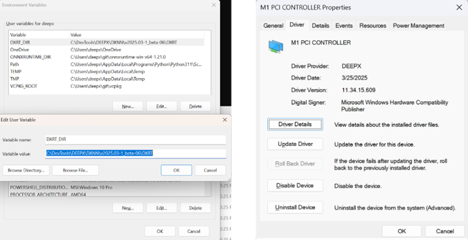

This chapter describes the system requirements and the installation instructions on Linux and WIndows to use **DX-APP**.

## System Requirements

This section describes the hardware and software requirements for running **DX-APP**.

**Hardware  Requirements**  

- **CPU:** amd64(x86_64), aarch64(arm64)
- **RAM:** 8GB RAM (16GB RAM or higher is recommended)
- **Storage:** 4GB or higher available disk space
- The system **must** support connection to an **M1 M.2** module with the M.2 interface on the host PC. 

{ width=700px }


**Note.** The **NPU Device Driver** and **DX-RT Library must** be installed. Refer to **DX-RT User Manual** for step-by-step installation instructions.  

---

## Installation on Linux

This section describes the software requirements and installation steps for setting up **DX-APP** on Ubuntu-based systems.

### Software Requirements on Linux  

To run **DX-APP** on Linux, the following components **must** be installed.  

- **OS**: Ubuntu 18.04 / 20.04 / 22.04 / 24.04 (x64)  
- **Deepx M1 Driver Version**: v1.7.1 or higher  
- **Deepx M1 Runtime Lib Version**: v3.0.0 or higher  

All required components are included in the **DXNN All Suite (DX-AS)** package.  


### Prerequisites Setup

**1. Install DX-RT Device Driver**  
To set up the build Environment, refer to **Section. Linux Device Driver Installation** in **DX-RT User Manual**.  

Once the DX-RT device driver is installed, the system should include both the PCIe driver and the runtime driver.  You can verify the installation by checking the loaded kernel modules.  

```
lsmod | grep dx

# dxrt_driver 53248 2
# dx_dma 475136 7 dxrt_driver
```

**2. Install DX-RT Library**   
To install the DX-RT library and NPU device driver, refer to **Section. Build Guide for Cross-compile** in **SDX-RT User Manual**.  

Once **DX-RT** is built, the runtime library and header files are installed in the following directory.  

- Libraries: `/usr/local/lib`  
- Headers: `/usr/local/include`  

```
set(DXRT_INSTALLED_DIR /usr/local)
```

If necessary, you can modify the installation path by editing `cmake/toolchain.x86_64.cmake`.  


### DX-APP Application Setup  

**1. DX-APP Installation Options**  
You can check the available **DX-APP** installation options by running the following command. 

```
./install.sh # --help
```
You can view more installation options by entering the `--help` flag.

**2. OpenCV Installation Options**  
If you want to enable CPU/GPU acceleration, OpenCV **must** be manually installed on your system.  
During the OpenCV build process, setting the following flags are needed.  

- `TBB=ON, IPP=ON, CUDA=ON`

If OpenCV is already installed, manually set the `OpenCV_DIR` path in your toolchain file.
```
set(CMAKE_SYSTEM_NAME Linux)
set(CMAKE_SYSTEM_PROCESSOR x86_64)
set(DXRT_INSTALLED_DIR /usr/local)
set(OpenCV_DIR /your/opencv/installation/dir)
set(onnxruntime_LIB_DIRS /usr/local/lib)
```

**3. Build and Run DX-APP**  
To build `dx_app`, run the following command. 
```
./build.sh ## Use --clean for a clean build
```

To download required models and sample videos, run the following command.  
```
./setup.sh
```

Assets are downloaded and placed in the `assets/` directory. The available assets include models for Classification, Object Detection, and Segmentation.  

To test `dx_app`, run the following command.  
```
./scripts/run_detector.sh
```
You can also use the `run_demo.sh` script to conveniently run a variety of demo applications included with DX-APP. This script provides an interactive menu that allows you to quickly test different AI models and features without needing to remember or type out complex command-line arguments.

To use the demo launcher, simply execute the following command in your terminal:

```
./run_demo.sh
  0: Object Detection (YOLOv7)
  1: Object Detection (YOLOv8N)
  2: Object Detection (YOLOv9S)
  3: Face Detection (YOLOV5S_Face)
  4: Pose Estimation
  5: Semantic Segmentation
  6: Multi-Channel Object Detection (YOLOv5)
  7: Multi-Model Object Detection (YOLOv5) & Segmentation
which AI demo do you want to run:(timeout:10s, default:0)
```

**4. Resolve Shared Library Errors**  
If you encounter shared library errors (e.g., `libdxrt.so`), update the system’s library cache. 
```
# Copy your library to /usr/local/lib
sudo cp your_library.so /usr/local/lib

# Update the system's library cache
sudo ldconfig
```
---

## Installation on Windows  

This section describes the software requirements and installation steps for setting up **DX-APP** on Windows systems.

### Software Requirements on Windows  

To run **DX-APP** on Windows, the following components **must** be installed.  

- **OS**: Windows 10 / 11  
- **Deepx M1 Driver Version**: v1.3.3 or higher  
- **Deepx M1 Runtime Lib Version**: v2.8.2 or higher  
- **Python**: Version 3.8 or higher (required for Python module support)  
- **Compiler**: Visual Studio Community 2022 (required for building C++ examples)  


### Install DX-RT and M1 Windows Device Driver  
   
DEEPX provides an official Windows installer for **DXNN Runtime (DX-RT)**, which includes the required runtime libraries and M1 device driver.  

- Installer Format: `DXNN_Runtime_v[version]_windows_[architecture].exe`  
- Example: `DXNN_Runtime_v2.8.2_windows_amd64.exe`  
- Default Directory Path: `C:/DevTools/DXNN/dxrt_v[version]`  

For detailed instructions, refer to **Section. Execute Installer** in **DX-RT User Manual**.

**To Install DX-RT components,** simply run the included installer.  
```
DXNN_Runtime_v2025.03-1_beta-06_windows_amd64.exe
```

By default, `dx_rt` is installed in  
```
C:\DevTools\DEEPX\DXNN\v2025.03-1_beta-06\DXRT
```

**To install M1 device driver,**  

- If you add the installation path to the `PATH` environment variable as `DXRT_DIR`, you can build and run `dx_app` without any modification to `dx_app/CMakeSettings.json`.  
- The M1 Device Driver will be installed with version **11.34.15.609**.  

{ width=700px }


### Install Visual Studio Community 2022  

To use **DX-APP** on Windows, Visual Studio Community 2022 **must** be installed with appropriate development tools.

**Installation Step**  

- **1.** Download Visual Studio Community 2022  
- **2.** Launch the installer and select the following workload  
  : Desktop development with C++  
- **3.** (Optional) Select additional workloads or individual components as needed  
- **4.** Click **Install** to begin the installation process  

{ width=700px }

**Note.** If Visual Studio Community 2022 is **not** installed, you may be prompted to install the **Microsoft Visual C++ Redistributable** (`VC_redist.x64.exe`) with administrator permissions.  


### (Optional) Install VCPKG  

VCPKG is a C++ package manager used for handling third-party dependencies like OpenCV.

**Note.** If you are using Visual Studio Community 2022, **VCPKG is pre-installed**. and no separate installation is necessary. 

If manual installation is required, follow the steps below.  

- **1.** Download the vcpkg package from GitHub  
- **2.** Open **Command Prompt** and Run the following command  
- **3.** Set the user variables  
  : Variable Name: `VCPKG_ROOT`  
  : Variable Value: Path to your vcpkg installation directory  

**Note.** This step is essential to allow Visual Studio to automatically detect and use VCPKG-managed packages like OpenCV.  

{ width=500px }

### Build and Install dx_app in Visual Studio Community 2022  

To build and run the `dx_app` application on Windows, follow the steps below using Visual Studio Community 2022.  

**Step 1. Open Project Folder**  

- **1.** Launch Visual Studio Community 2022  
- **2.** From the start screen, select **Open a local folder**  
- **3.** Navigate to and select the `dx_app` project folder   

{ width=700px }

**Step 2. Project Configuration**  
Upon opening the project,  

- Dependencies specified in `vcpkg.json` will be automatically downloaded and installed into the `vcpkg_installed` directory.  
- CMake will automatically generate the build cache and configuration.  

{ width=700px }

**Step 3. (Optional) Edit CMakeSettings**  
If needed, you can manually specify the following environment variables in `CMakeSettings.json`.  

- `DXRT_DIR`: Path to the installed DX-RT runtime  
- `OpenCV_DIR`: Path to the OpenCV installation (if manually installed)  

```
{
    "name": "CMAKE_TOOLCHAIN_FILE",
    "value": "${env.VCPKG_ROOT}\\scripts\\buildsystems\\vcpkg.cmake",
    "type": "STRING"
},
{
    "name": "DXRT_DIR",
    "value": "C:\\DevTools\\DEEPX\\DXNN\\v2025.03-1_beta-06\\DXRT",
    "type": "STRING"
},
{
    "name": "OpenCV_DIR",
    "value": "${projectDir}\\vcpkg_installed\\x64-windows",
    "type": "STRING"
}
```

**Step 4. Register `PATH` Variable**  
Ensure the required runtime libraries are accessible with the system’s `PATH` environment variable.  

- `DXRT_DIR` is referenced in CMAKE as `${env.DXRT_DIR}`.

**Note.** If you are using `dx_app/vcpkg.json`, OpenCV will be automatically downloaded and installed into `vcpkg_installed/x64-windows` directory during CMake configuration step. 

{ width=700px }


**Step 5. Build and Install `dx_app`**  
To build and install the dx_app application.  

- **1.** In Visual Studio Community 2022, go to the **Build** menu  
- **2.** Click **Build All** (or **Rebuild All**) to begin the build process  

Upon successful compilation, the application executable will be generated under the `bin/` directory.

{ width=600px }


### Run Example Demo Executable Files On Windows  

After building and installing dx_app, you can execute the demo applications using provided batch scripts.  

**Step 1. Execute `setup.bat`**  
Run the `setup.bat` script to automatically download all required models and sample videos.  

- The downloaded assets will be placed in the `assets` folder.  
- The assets include models for Classification, Object Detection, and Segmentation.  

OpenCV Dependency Handling  

- If OpenCV was installed using vcpkg, it will be located in the `vcpkg_installed/x64-windows` directory. The batch files automatically append this path in the `PATH` environment variable.  
- If OpenCV is installed manually (e.g., custom installation),  
  : You **must** manually add the OpenCV library and DLL directories to the `PATH`, or  
  : You **must** manually modify the batch file variables, `OPENCV_LIB_PATH` and  `OPENCV_DLL_PATH`.  

{ width=700px }

**Step 2. Run the Demo**  
Once setup is complete,  

- Navigate to the `bin/` directory.  
- Run the desired demo using the appropriate batch file.  

For example, to launch the classification demo as follows (`run_classifier.bat`)  
```
@echo off
setlocal

set "OPENCV_LIB_PATH=%~dp0\vcpkg_installed\x64-windows\lib\"
set "OPENCV_DLL_PATH=%~dp0\vcpkg_installed\x64-windows\bin\"
set PATH=%OPENCV_LIB_PATH%;%OPENCV_DLL_PATH%;%PATH%
set "APP_JSON_PATH=%~dp0\example\imagenet_example.json"
start cmd /K "%~dp0\bin\run_classifier.exe" -c %APP_JSON_PATH%

endlocal
```

This will execute the classification demo using the downloaded model and sample image. The result will be displayed in the terminal and saved to the output directory if applicable.  

---
