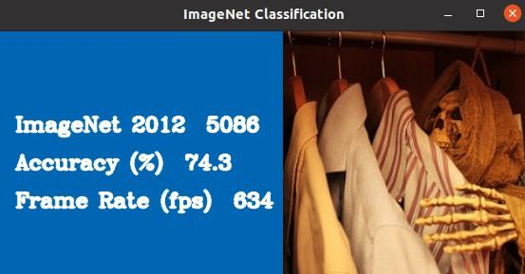
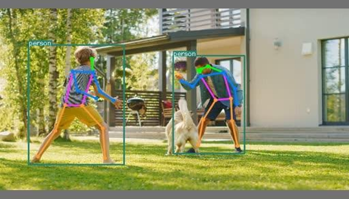
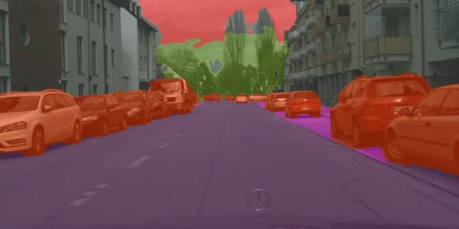
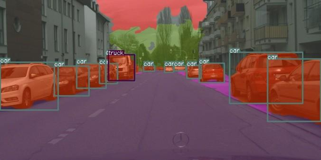

This chapter introduces a quick-start experience using pre-built demo applications provided by **DX-APP**. These applications allow developers to evaluate DeepX NPU performance on common vision AI tasks such as classification, detection, and segmentation. Developers can modify the examples or use them as templates to build custom applications.  

**Note.** Performance results may vary depending on host system specifications, as the demos include host-side pre-processing, post-processing, and rendering operations.  

---

## C++ Demo Application List  

**DX-APP** provides the following C++ demo applications.  

- **Classification**: Basic Classification, ImageNet Classification  
- **Object Detection**: Yolo Object Detection, Yolo Object Detection - Multi Channel  
- **Pose Estimation**: Human Pose Estimation  
- **Segmentation**: Semantic Segmentation PIDNet (CityScape dataset Only), Semantic Segmentation PIDNet (CityScape dataset Only) + Yolo Object Detection  

---

## Running Demo Executables  

Each demo can be executed on Linux or Windows.  

### Classification  

This section demonstrates how to run the ImageNet Classification demo on Windows.  

- Model: ImageNet-trained `EfficientNetB0_4.dxnn` model  
- Input: Single image file  
- Output: Top-1 classification result printed to the terminal  

**Classification Demo**  

- Linux Command  

```
./bin/classification -m assets/models/EfficientNetB0_4.dxnn -i sample/ILSVRC2012/1.jpeg
```

- Windows Command  

```
bin\classification.exe -m assets/models/EfficientNetB0_4.dxnn -i sample/ILSVRC2012/1.jpeg
```

- Output Example  

```
Top1 Result : class 321
```

**ImageNet Classification Demo**  

- Linux Command  

```
./bin/imagenet_classification -m assets/models/EfficientNetB0_4.dxnn -i example/imagenet_classification/imagenet_val_map.txt -p sample/ILSVRC2012/
```

- Windows Command  

```
bin\imagenet_classification.exe -m assets\models\EfficientNetB0_4.dxnn -i example\imagenet_classification\imagenet_val_map.txt -p sample\ILSVRC2012\
```

- Output Example  

{ width=400px }

The output shows the accuracy of the classification result is **74.3%** and the frame rate (rps) is **634**.  


### Object Detection  

This section explains how to run object detection demos using YOLOv5 models. Both single-stream and multi-stream inference scenarios are supported.  

- Model: `yolov5s_512`  

**YOLO Object Detection - Single Channel**  
This demo performs object detection on a single input stream using a YOLOv5 model.  

- Output Example: Upon execution, the application displays detected objects.  

```
./bin/yolo -m assets/models/YOLOV5S_3.dxnn -i sample/1.jpg -p 1
...
Detected 8 boxes.
    BBOX:person(0) 0.859366, (307.501, 138.443, 400.977, 364.696)
    BBOX:oven(69) 0.661055, (-0.446404, 225.652, 155.377, 325.085)
    BBOX:bowl(45) 0.564862, (46.2462, 314.978, 105.182, 347.728)
    BBOX:person(0) 0.561198, (0.643028, 295.378, 47.8478, 331.855)
    BBOX:oven(69) 0.494507, (390.414, 245.532, 495.489, 359.54)
    BBOX:bowl(45) 0.47086, (-0.300865, 328.801, 69.139, 379.72)
    BBOX:bowl(45) 0.452027, (25.9788, 359.192, 80.7059, 392.734)
    BBOX:pottedplant(58) 0.368497, (0.423544, 86.835, 51.0048, 206.592)
```

In this example, a person is detected with **confidence 0.859**, and the bounding box is defined by the four coordinates.

{ width=600px }

**Pre-processing and Post-processing Parameters**  
YOLO models in **DX-APP** require external configuration for pre-processing and post-processing parameters. These parameters are not embedded in the `.dxnn` model.file.  

Pre-processing and post-processing parameters  

- Defined in:  `yolo_cfg.cpp`  
- Referenced in: `yolo_demo.cpp`  
 
To customize,  

- Modify the existing parameters in both files, or   
- Add new parameter entries with a new model name to both files.  

```
YoloParam yolov5s_512 = {
    .height = 512,
    .width = 512,
    .confThreshold = 0.25,
    .scoreThreshold = 0.3,
    .iouThreshold = 0.4,
    .numBoxes = -1,
    .numClasses = 80,
    .layers = {
        {
            .numGridX = 64,
            .numGridY = 64,
            .numBoxes = 3,
            .anchorWidth = { 10.0, 16.0, 33.0 },
            .anchorHeight = { 13.0, 30.0, 23.0 },
            .tensorIdx = { 0 },
        },
        .
        .
        .
    },
    .classNames = {"person" ,"bicycle" ,"car" ,"motorcycle", . . .}
}
```

**YOLO Object Detection - Multi Channel**  
This demo performs object detection on multiple input streams simultaneously using a YOLOv5 model. 

- Output Example: Upon execution, detection results across all input streams will be displayed in a tiled or multi-channel format.  

```
./bin/yolo_multi -c ./example/yolo_multi/yolo_multi_demo.json

```

{ width=700px }


**JSON Configuration for Multi-Channel YOLO Demo**  
The multi-channel demo uses a JSON configuration file to to define the input sources and model behavior.  

- File Location: `example/yolo_multi/yolo_multi_input_source_demo.json`  

Edit this file to customize the input video sources and number of streams.  

**Offline Mode in Input Method**  
To run detection in offline mode (for video file)  

- Set the `video_sources` field in the JSON file  
- Specify the number of frames to process as the third parameter  

```
{
    "usage": "multi",
        "model_path": "/model_path/yolov5s_512", "model_name": "yolov5s_512",

        "video_sources": [
            ["./assets/videos/dron-citry-road.mov", "realtime"], 
            ["/dev/video0", "camera"],
            ["./sample/1.jpg", "image"], 
            ["rtsp://210.99.70.120:1935/live/cctv010.stream", "rtsp"], 
            ["./assets/videos/dance-group.mov", "offline", 400]
        ],

        "display_config": {
            "display_label": "output", 
            "capture_period": 33,
            "output_width": 1920,
            "output_height": 1080, 
            "show_fps": true
    }
}
```

**Pre-processing and Post-processing Parameters**  
YOLO models in **DX-APP** require external configuration for pre-processing and post-processing parameters. These parameters are **not** embedded in the compiled `.dxnn` model file.  

Pre-processing and post-processing parameters  

- Defined in: `yolo_cfg.cpp`  
- Referenced in: `yolo_demo.cpp`  

To customize,  

- Modify the existing parameters in both files, or  
- Add new parameter entries with a new model name to both files.  

```
YoloParam yolov5s_512 = {
    .height = 512,
    .width = 512,
    .confThreshold = 0.25,
    .scoreThreshold = 0.3,
    .iouThreshold = 0.4,
    .numBoxes = -1,
    .numClasses = 80,
    .layers = {
        {
            .numGridX = 64,
            .numGridY = 64,
            .numBoxes = 3,
            .anchorWidth = { 10.0, 16.0, 33.0 },
            .anchorHeight = { 13.0, 30.0, 23.0 },
            .tensorIdx = { 0 },
        },
        .
        .
        .
    },
    .classNames = {"person" ,"bicycle" ,"car" ,"motorcycle", . . .}
};
```

```
YoloParam getYoloParameter(string model_name){ 
    if(model_name == "yolov5s_320")
        return yolov5s_320;
    else if(model_name == "yolov5s_512") 
        return yolov5s_512;
    else if(model_name == "yolov5s_640") 
        return yolov5s_640;
    else if(model_name == "yolox_s_512") 
        return yolox_s_512;
    else if(model_name == "yolov7_640") 
        return yolov7_640;
    else if(model_name == "yolov7_512") 
        return yolov7_512;
    else if(model_name == "yolov4_608") 
        return yolov4_608;
    return yolov5s_512;
}
```

**RTSP Stream Input**  
To run a demo using an **RTSP** video stream, configure the input source in the JSON file as follows.  

- Set the **RTSP** stream address under the `video_sources` field  
- Set the network type to `rstp`  

```
{
    .
    .
    .
    "video_sources": [
        ["rtsp://your_rtsp_stream_address", "rtsp"]
    ],
    .
    .
    .
}
```

This enables real-time inference directly from network video streams using DEEPX NPU.  


### Pose Estimation  

This section explains how to run pose estimation demos based on Ultralytics YOLO Pose model using DEEPX NPU.  

- Model: Ultralytics YOLO Pose (`YOLOV5Pose640_1.dxnn`)  

**Pose Estimation**
```
./bin/pose -m assets/models/YOLOV5Pose640_1.dxnn -i sample/7.jpg -p 0
```

The YOLO pose model predicts human key points for each detected person within an image or video frame.  

{ width=600px }

**Tensor Shape and Alignment**  
The input and output tensors of the model use the NHWC format by default.  

Due to DeepX NPU architecture constraints, the number of channels (including output classes) **must** be aligned based on the following rule.  

- If the channel count is less than 64, it is aligned to the nearest multiple of 16 bytes.  
- If the channel count is 64 or greater, it is aligned to the nearest multiple of 64 bytes.  

Example  

- Original shape: **[1, 40, 52, 36]**  
- Aligned shape: **[1, 52, 36, 40 + 24]** (adding 24 bytes of dummy to satisfy alignment.)  

This alignment ensures the tensor complies with NPU processing requirements.  

```
inputs
    images, INT8, [1, 640, 640, 3,  ], 0
outputs
    /0/model.33/m_kpt.0/Conv_output_0, FLOAT, [1, 80, 80, 192, ], 0 
            ----> Key points per 3 anchor boxes
    /0/model.33/m.0/Conv_output_0, FLOAT, [1, 80, 80, 64, ], 0	
            ----> Object Box Info
    /0/model.33/m_kpt.1/Conv_output_0, FLOAT, [1, 40, 40, 192, ], 0
    /0/model.33/m.1/Conv_output_0, FLOAT, [1, 40, 40, 64, ], 0
    /0/model.33/m_kpt.2/Conv_output_0, FLOAT, [1, 20, 20, 192, ], 0
    /0/model.33/m.2/Conv_output_0, FLOAT, [1, 20, 20, 64, ], 0
    /0/model.33/m_kpt.3/Conv_output_0, FLOAT, [1, 10, 10, 192, ], 0
    /0/model.33/m.3/Conv_output_0, FLOAT, [1, 10, 10, 64, ], 0
```

**Pre-processing and Post-processing Parameters**  
Yolo Pose models do not embed external pre-processing and post-processing parameters in the compiled `.dxnn` file.  

- Parameters defined in: `pose_estimation/yolo_cfg.cpp`  
- Parameters referenced in: `pose_demo.cpp`   

```
// pre/post parameter table
YoloParam yoloParams[] = {
    [0] = yolov5s6_pose_640, // ----> p option : 0
    [1] = yolov5s6_pose_1280
};
```

To configure custom pose estimation parameters  

- Modify the existing entries in the configuration files, or  
- Add new model-specific configurations  

This setup ensures that the NPU output is properly decoded into keypoint coordinates and bounding boxes.  


### Segmentation  
This section explains how to run semantic segmentation demos based on YOLOv5 models. Both semantic segmentation models are supported.  

- Model: `DeepLabV3PlusMobileNetV2_2.dxnn`  

**Semantic Segmentation - Cityscape Dataset-Based Demo**  
This demo describes an example of semantic segmentation based on the DeepLabV3Plus model trained on the **Cityscape** dataset, designed for detailed urban scene parsing.  

- Model: `DeepLabV3PlusMobileNetV2_2.dxnn`  
- Path: `assets/models`  
- Dataset: Trained on the **Cityscape** dataset  

This model performs pixel-wise classification, assigning a semantic label to each pixel in the input image. This allows for dense and structured scene understanding.  

**Notes.**  

- Load `DeepLabV3PlusMobileNetV2_2.dxnn` in the segmentation pipeline.  
- Use the **Cityscape** class index mappings to interpret the output mask.  

```
/* class_index, class_name, colorB, G, R */
SegmentationParam segCfg[] = {
    { 0 , "road" , 128 , 64 , 128 , },
    { 1 , "sidewalk" , 244 , 35 , 232 , },
    { 2 , "building" , 70 , 70 , 70 , },
    { 3 , "wall" , 102 , 102 , 156 , },
    { 4 , "fence" , 190 , 153 , 153 , },
    { 5 , "pole" , 153 , 153 , 153 , },
    { 6 , "traffic light" , 51 , 255 , 255 , },
    { 7 , "traffic sign" , 220 , 220 , 0 , },
    { 8 , "vegetation" , 107 , 142 , 35 , },
    { 9 , "terrain" , 152 , 251 , 152 , },
    { 10 , "sky" , 255 , 0 , 0 , },
    { 11 , "person" , 0 , 51 , 255 , },
    { 12 , "rider" , 255 , 0 , 0 , },
    { 13 , "car" , 255 , 51 , 0 , },
    { 14 , "truck" , 255 , 51 , 0 , },
    { 15 , "bus" , 255 , 51 , 0 , },
    { 16 , "train" , 0 , 80 , 100 , },
    { 17 , "motorcycle" , 0 , 0 , 230 , },
    { 18 , "bicycle" , 119 , 11 , 32 , },
};
```

```
./bin/pidnet -m assets/models/DeepLabV3PlusMobileNetV2_2.dxnn -i sample/8.jpg
```

{ width=600px }


**Semantic Segmentation - Object Detection Demo**  
This demo explains segmentation capabilities by combining semantic segmentation and object detection.  

- Segmentation Model: `DeepLabV3PlusMobileNetV2_2.dxnn`  
- Object Detection Model: YOLOv5  

How It Works,  

- The segmentation model classifies every pixel into semantic categories such as road, person, or building  
- The detection model locates and classifies objects such as e.g., cars, traffic signs  

Benefits of Combined Pipeline  

- Semantic segmentation provides context-aware, fine-grained understanding of background and scene layout  
- Object detection focuses on identifying and locating distinct object instances  

```
./bin/od_pid -m0 assets/models/YOLOV5S_3.dxnn -m1 assets/models/DeepLabV3PlusMobileNetV2_2.dxnn -i sample/8.jpg
```

{ width=600px }

---
