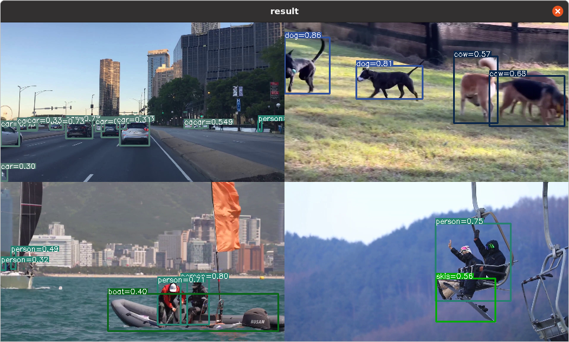

This section describes how to run classification and object detection tasks using the **DX-APP** application template system. Templates allow you to execute demos by simply modifying a JSON configuration file—no code changes are required.  

Currently, the supported application templates are Classification and YOLO-based Object Detection.  

**Note.** If your YOLO model requires custom decoding logic, you **must** manually update the yoloCustomDecode function located in `lib/utils/ box_decode.hpp`.  

Related Sections are as follows.  

- Section. Classification Templates  
- Section. Object Detection Templates  
- Section. Python Examples Templates  

---

## Classification Template

Here is an example of a classification template.  

```
./bin/run_classifier -c example/run_classifier/imagenet_example.json
...
[example/ILSVRC2012/0.jpeg] Top1 Result : class 831 (studio couch, day bed) 
[example/ILSVRC2012/1.jpeg] Top1 Result : class 321 (admiral) 
[example/ILSVRC2012/2.jpeg] Top1 Result : class 846 (table lamp) 
[example/ILSVRC2012/3.jpeg] Top1 Result : class 794 (shower curtain)
```

The `example/run_classifier/imagenet_example.json` file is a sample configuration for running a classification model. You can use this file as a reference to customize input and output settings, and optionally modify the application section to control how classification results are displayed or saved as follows.  

```
"application": {
    "description": "result of post-processing after inference, you can use \"save\" or \"realtime\" or \"none\"", "type": "save"
}
```

For a detailed explanation of how classification works, refer to **Section. Classification Template Guide**.  

{ width=400px }

---

## Object Detection Template

Here is an example of an objection detection template.  

```
./bin/run_detector -c example/run_detector/yolov5s3_example.json
    ...
    detected : 9
```

The `example/run_detector/yolov5s3_example.json` file is a sample configuration for running an object detection model. You can use this file as a reference to customize the input and output settings, and optionally modify the application section to control how detection results are displayed and saved.  

```
"application": {
    "description": "result of post-processing after inference, you can use \"save\" or \"realtime\" or \"none\"",
    "type": "realtime"
}
```

The `type` field in the JSON configuration defines how detection results are handled.  

- `save`: Saves the output file as a video file  
- `realtime`: Displays the output on the screen  
- `none`: Prints the count of detection results continuously to the terminal  

In the previous example, the json file sets `type` as `none`.   
If you want to save the output, change it to `save`.  

{ width=600px }

When using a YOLO model, post-processing parameters can be customized based on the official YOLOv5 configuration. You may also modify the class information directly in the JSON file, so no code recompilation is required.  

The `yolo_basic` method supports standard decoding for YOLOv3, YOLOv5, and YOLOv7. Other supported decoding types include `yolo_scale`, `yolox`, `yolo_pose`, and `scrfd`.  

Refer to the corresponding JSON configuration file for detailed information.  

```
"model":{
    "path":"assets/models/YOLOV5S_3.dxnn",
    "param":{
        "name":"yolov5s_512",
        "score_threshold":0.25,
        "iou_threshold":0.3,
        "last_activation":"sigmoid",
        "decoding_method":"yolo_basic",
        "box_format":"center",
        "layer":[
            {
            "name":"2", "stride": 8,
            "anchor_width": [10, 16, 33],
            "anchor_height": [13, 30, 23]
            },
            {
            "name":"1", "stride": 16,
            "anchor_width": [30, 62, 59],
            "anchor_height": [61, 45, 119]
            },
            {
            "name":"0", "stride": 32,
            "anchor_width": [116, 156, 373],
            "anchor_height": [90, 198, 326]
            }
        ]
    }
}
```

The template also supports multi-channel detection, allowing multiput input streams (i.e., images files, video files, and camera devices) to be processed simultaneously.  

To enable this, list the input sources in the `sources` field of the `input` section in your JSON configuration. The output from each channel will be displayed in a checkerboard layout.  

When `type` in the `sources` field of the `input` section is set to `video`, you can additionally specify the number of frames to process. This provides control over how many frames are used for pre-processing and inference.

```
"input":{
    "format":"RGB",
    "sources":[
        {
            "type":"image", "path":"/your-sample-image-path/1.jpg"
        },
        {
            "type":"video", "path":"/your-sample-video-path/1.mp4"
        },
        {
            "type":"video", "path":"/your-sample-video-path/1.mp4", "frames":100
        },
        {
            "type":"camera", "path":"/dev/video0"
        }
    ]
},
```

{ width=600px }

If you are using a custom YOLO model that does **not** follow the standard decoding logic, or if you are **not** using the `yolo_basic` decoding method, you **must** implement a custom decode function.  

You can use the existing yoloXDecode function in `lib/utils/box_decode.hpp` as a reference. Analyze the decoding logic and write your own implementation tailored to your model’s output tensor format.  

- Path: `lib/utils/box_decode.hpp`  

```
dxapp::common::BBox yoloCustomDecode(std::function<float(float)> activation, std::vector<float*> datas, dxapp::common::Point grid, dxapp::common::Size
anchor, int stride, float scale)
{
    /**
        * @brief adding your decode method
        *
        * example code ..
        * float* data = datas[0];
        * dxapp::common::BBox box_temp;
        * box_temp._xmin = (activation(data[0]) * 2. - 0.5 + grid._x ) * stride; //center x
        * box_temp._ymin = (activation(data[1]) * 2. - 0.5 + grid._y ) * stride; //center y
        * box_temp._width = std::pow((activation(data[2]) * 2.f), 2) * anchor._width;
        * box_temp._height = std::pow((activation(data[3]) * 2.f), 2) * anchor._height;
        * dxapp::common::BBox result = {
        *     ._xmin=box_temp._xmin - box_temp._width / 2.f,
        *     ._ymin=box_temp._ymin - box_temp._height / 2.f,
        *     ._xmax=box_temp._xmin + box_temp._width / 2.f,
        *     ._ymax=box_temp._ymin + box_temp._height / 2.f,
        *     ._width = box_temp._width,
        *     ._height = box_temp._height,
        * };
        *
    */

    dxapp::common::BBox result;

    return result;
};
```

**Note.** Once you modify the code, you **must** recompile it.
```
./build.sh
```

For a detailed explanation of how to write your models' custom post-processing, refer to **Section. Object Detection Template Guide**.

---
