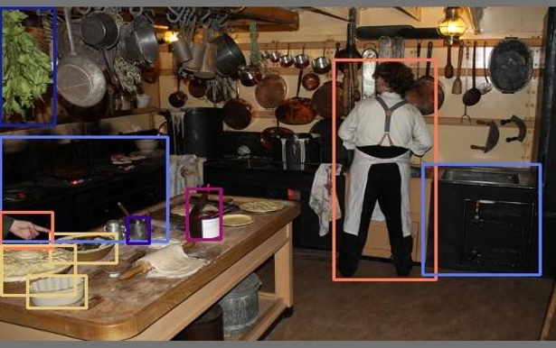

This section describes how to run inference and post-processing on DeepX NPUs using Python. It includes examples for image classification and object detection (YOLO series), as well as post-processing acceleration via Pybind11.

---

## Python Example Guide

This section provides a step-by-step guide to implementing Python-based preprocessing, inference, and post-processing for DeepX NPUs. It covers the full workflow—from installing the dx_engine package and preparing aligned input data to running inference and handling model outputs.  

**Step 1. Install dx_engine**   
To Install the `dx_engine` Python Package, navigate to the `python_package` folder inside the `dx_rt` directory and run the following command.  
```
cd /your-dxrt-directory/python_package
pip install .
```

Example output
```
Successfully built dx-engine
Installing collected packages: dx-engine
  Attempting uninstall: dx-engine
    Found existing installation: dx-engine 1.0.0
    Uninstalling dx-engine-1.0.0:
      Successfully uninstalled dx-engine-1.0.0
Successfully installed dx-engine-1.0.0

```

**Step 2. Import dx_engine Python Module**  
Start by importing the necessary module.  
```
from dx_engine import InferenceEngine
```

**Step 3. Create an Input Tensor**  
First, create an inference engine instance by specifying the model path. Then, generate an input tensor based on the model’s input size.  
```
import numpy as np
from dx_engine import InferenceEngine

ie = InferenceEngine("assets/models/YOLOV5S_3.dxnn")
input_tensor = np.array(ie.input_size(), dtype=np.uint8)
# Adjust the type according to the input data you are using
```

**Step 4. Preparing an Image Aligned for the NPU**  
Create and adjust an input image to meet the alignment requirements of the NPU.  
```
import numpy as np
import cv2
from dx_engine import InferenceEngine

def preprocessing(image, new_shape=(224, 224), align=64, format=None):
    image = cv2.resize(image, new_shape)
    h, w, c = image.shape
    if format is not None:
        image = cv2.cvtColor(image, format)
    if align == 0 :
        return image
    length = w * c
    align_factor = align - (length - (length & (-align)))
    image = np.reshape(image, (h, w * c))
    dummy = np.full([h, align_factor], 0, dtype=np.uint8)
    image_input = np.concatenate([image, dummy], axis=-1)

    return image_input

ie = InferenceEngine("assets/models/EfficientNetB0_4.dxnn")
image_src = cv2.imread("images/1.jpg", cv2.IMREAD_COLOR)
if ie.input_size() == 224 * 224 * 3:
    align = 0
else:
    align = 64

image_input = preprocessing(image_src, new_shape=(224, 224), align=align, format = cv2.COLOR_BGR2RGB)
```

### Run ImageNet Python Example (Classification) 

This section demonstrates how to run image classification examples using Python on DeepX NPUs.  

To check the usage and available options: `python imageNet_example.py --help`  

**Classification**  
```
python template/python/imageNet_example.py
```

or

```
python template/python/imageNet_example.py --config example/run_classifier/imagenet_example.json
  ...
  [example/ILSVRC2012/0.jpeg] Top1 Result : class 831 (studio couch, day bed)
  [example/ILSVRC2012/1.jpeg] Top1 Result : class 321 (admiral)
  [example/ILSVRC2012/2.jpeg] Top1 Result : class 846 (table lamp)
  [example/ILSVRC2012/3.jpeg] Top1 Result : class 794 (shower curtain)
```

**Steps**  

- **1.** Import The InferenceEngine module which is a callable inference engine module.  
```
from dx_engine import InferenceEngine
```

- **2.** Initialize the Inference Engine with `InferecneEngine` module.  
```
ie = InferenceEngine("./assets/models/EfficientNetB0_4.dxnn")
```

- **3.** Prepare the Input Tensor  
  : Input and output tensor shapes follow the format: [N, H, W, C]    
  : Input data **must** be aligned to the nearest multiple of 64 bytes.  


**Note.** You **must** refer to the `python/imageNet_example.py` and re-arrange input data.  

```
def preprocessing(image, new_shape=(224, 224), align=64, format=None):
    image = cv2.resize(image, new_shape)
    h, w, c = image.shape
    if format is not None:
        image = cv2.cvtColor(image, format)
    if align == 0 :
        return image
    length = w * c
    align_factor = align - (length - (length & (-align)))
    image = np.reshape(image, (h, w * c))
    dummy = np.full([h, align_factor], 0, dtype=np.uint8)
    image_input = np.concatenate([image, dummy], axis=-1)

    return image_input
```

**Output Handling**  
Using ArgMax Layer  

- The provided `EfficientNetB0_4` model ends with an ArgMax layer  
- Output: a single `uint16_t` value (2 bytes) representing the Top-1 class index  

```
Task[0] npu_0, NPU, 8209728bytes (input 157696, output 2)
  inputs
    data, INT8, [1, 224, 224, 3, ], 0
  outputs
    argmax_output, UINT16, [1, ], 0
```

This value can be used as follows.  
```
ie_output = ie.Run(image_input)
output = ie_output[0][0]
print("[{}] Top1 Result : class {} ({})".format(input_path, output, classes[output]))
```

Using GAP or FC Layer  
If the final layer is a Global Average Pooling (GAP) or Fully Connected (FC) layer.  
- Output shape: `[1, 1, 1, num_classes]`  

Due to DeepX NPU architecture constraints, the number of channels (including output classes) **must** be aligned based on the following rule.  

- If the channel count is less than 64, it is aligned to the nearest multiple of 16 bytes.  
- If the channel count is 64 or greater, it is aligned to the nearest multiple of 64 bytes.  

Apply Softmax to convert logits into class probabilities  
```
def postprocessing(outputs, n_classes):
    outputs = outputs[...,:n_classes]
    exp_result = np.exp(outputs - np.max(outputs))
    exp_result = exp_result / exp_result.sum()
    top1 = np.argmax(exp_result)
    return top1
    .
    .
    .
    ie_output = ie.Run(image_input)
    output = postprocessing(ie_output[0], len(classes))
    print("[{}] Top1 Result : class {} ({})".format(input_path, output, classes[output]))
```

### Run YoloV5S Python Example (Object Detection)  

This section demonstrates how to run object detection examples using Python on DeepX NPUs.  

To see available options for detection: `python yolov5s_example.py --help`

**Object Detection**  
```
python template/python/yolov5s_example.py
```

or

```
python template/python/yolov5s_example.py --config example/run_detector/yolov5s3_example.json
  ...
  [Result] Detected 10 Boxes.
  [0] conf, classID, x1, y1, x2, y2, : 0.8771, person(0), 307, 139, 401, 364
  [1] conf, classID, x1, y1, x2, y2, : 0.7358, bowl(45), 46, 317, 107, 347
  [2] conf, classID, x1, y1, x2, y2, : 0.7192, bowl(45), 25, 360, 79, 393
  [3] conf, classID, x1, y1, x2, y2, : 0.6766, oven(69), 0, 218, 154, 325
  [4] conf, classID, x1, y1, x2, y2, : 0.5811, oven(69), 389, 246, 497, 359
  [5] conf, classID, x1, y1, x2, y2, : 0.5664, person(0), 0, 295, 48, 332
  [6] conf, classID, x1, y1, x2, y2, : 0.5365, bowl(45), 1, 329, 69, 380
  [7] conf, classID, x1, y1, x2, y2, : 0.4199, potted plant(58), 0, 86, 50, 206
  [8] conf, classID, x1, y1, x2, y2, : 0.3649, bottle(39), 172, 271, 203, 323
  [9] conf, classID, x1, y1, x2, y2, : 0.3084, cup(41), 117, 300, 137, 327
  ...
```

**Steps**  
After model conversion, you can optionally perform CPU-based post-processing by using the `cpu_0.onnx` output file in conjunction with the compiled `.dxnn` model.  
To do this, modify the Python application as needed, referring to the example implementation in `./python/yolov5s_example.py`.

{ width=600px }

- **1.** Import the Inference Module which is a callable inference engine module.
```
from dx_engine import InferenceEngine
```

- **2.** Initialize with YOLO Model with `InferecneEngine` module.
```
ie = InferenceEngine("./assets/models/YOLOV5S_3.dxnn")
```

- **3.** Understand Channel Alignment  

YOLO models typically have 255 output channels  

- (80 classes + 1 objectness + 4 bbox) × 3 anchors = 255  

Due to DeepX NPU architecture constraints, the number of channels (including output classes) **must** be aligned based on the following rule.  

- If the channel count is less than 64, it is aligned to the nearest multiple of 16 bytes.  
- If the channel count is 64 or greater, it is aligned to the nearest multiple of 64 bytes.  

Final output is 256 channels  
 
- **4.** Decode the Output  

Use the `all_decode()` function in `python/yolov5s_example.py` - lines 74–102  
This handles decoding bounding boxes, class scores, and filtering  

```
image_src = cv2.imread(input_path, cv2.IMREAD_COLOR)
image_input, _, _ = letter_box(image_src, new_shape=(int(input_size), int(input_size)), fill_color=(114, 114, 114), format=cv2.COLOR_BGR2RGB)

''' detect image (1) run dxrt inference engine, (2) post processing'''
ie_output = ie.Run(image_input)
print("dxrt inference Done! ")
decoded_tensor = []
if ie.output_dtype()[0] == "BBOX":
    decoded_tensor = ppu_decode(ie_output, layers)
elif len(ie_output) > 1:
    cpu_model_path = os.path.join(os.path.split(model_path)[0], "cpu_0.onnx")
    if os.path.exists(cpu_model_path):
        decoded_tensor = onnx_decode(ie_output, cpu_model_path)
    else:
        decoded_tensor = all_decode(ie_output, layers)
else:
    decoded_tensor = ie_output[0]
print("decoding output Done! ")

''' post Processing '''
x = np.squeeze(decoded_tensor)
x = x[x[..., 4]>score_threshold]
box = ops.xywh2xyxy(x[..., :4])
x[:,5:] *= x[:,4:5]
conf = np.max(x[..., 5:], axis=-1, keepdims=True)
j = np.argmax(x[..., 5:], axis=-1, keepdims=True)
mask = conf.flatten() > score_threshold
filtered = np.concatenate((box, conf, j.astype(np.float32)), axis=1)[mask]
sorted_indices = np.argsort(-filtered[:, 4])
x = filtered[sorted_indices]
x = torch.Tensor(x)
x = x[torchvision.ops.nms(x[:,:4], x[:, 4], score_threshold)]

''' save result and print detected info '''
print("[Result] Detected {} Boxes.".format(len(x)))
image = cv2.cvtColor(image_input, cv2.COLOR_RGB2BGR)
colors = np.random.randint(0, 256, [80, 3], np.uint8).tolist()
for idx, r in enumerate(x.numpy()):

    pt1, pt2, conf, label = r[0:2].astype(int), r[2:4].astype(int), r[4], r[5].astype(int)
    print("[{}] conf, classID, x1, y1, x2, y2, : {:.4f}, {}({}), {}, {}, {}, {}"
        .format(idx, conf, classes[label], label, pt1[0], pt1[1], pt2[0], pt2[1]))
    image = cv2.rectangle(image, pt1, pt2, colors[label], 2)
cv2.imwrite("yolov5s.jpg", image)
print("save file : yolov5s.jpg ")
```

---

## YOLO Post-Processing Optimization Using Pybind11

### Overview

Post-processing for YOLO models can be implemented in Python using libraries such as numpy and `torchvision.ops.nms`. This is demonstrated in `/template/python/yolov5s_example.py` and `/template/python/yolov_async.py`.  

However, these Python-based implementations may not offer optimal performance in terms of latency, particularly for real-time applications.  

To maximize FPS (Frames Per Second) in time-sensitive scenarios, it's recommended to implement performance-critical post-processing steps—such as score filtering, bounding box decoding, and Non-Maximum Suppression (NMS)—in C++, and integrate them into Python using Pybind11.  

This approach significantly reduces latency by offloading heavy computations to native C++ code while maintaining the usability of Python.  


The typical YOLO post-processing pipeline consists of the following steps.  

- Score filtering  
- Bounding box decoding  
- NMS (Non-Maximum Suppression)  


These steps involve intensive matrix operations and iterative loops, making them performance-critical. Executing them in C++ is significantly more efficient than in Python, especially for real-time applications.  

To address this, DX-APP provides the dx_postprocess module, which includes the YoloPostProcess class, an optimized C++ implementation of YOLO post-processing exposed to Python with Pybind11.  

By using YoloPostProcess, users can perform end-to-end YOLO post-processing with a single function call, supporting a variety of YOLO model types with minimal effort and maximum performance.  


###  Supported Use Cases for  YoloPostProcess

The behavior of YOLO post-processing can vary depending on the model type and runtime configuration. Even within the same YOLO version, the post-processing flow may differ based on  

- Whether PPU (Post-Processing Unit) was enabled during model compilation via DX-COM  
- Whether `USE_ORT=ON` was set during DX-RT runtime build  

To simplify integration, the `Run()` method of the YoloPostProcess class automatically handles these variations.  

- If PPU is enabled, all model types (e.g., BBOX, FACE, POSE) are supported without additional configuration.  
- If PPU is disabled, support depends on the `USE_ORT`setting during build time.  

For models compiled without PPU, the availability of post-processing via YoloPostProcess depends on whether `USE_ORT=ON` was enabled during DX-RT build configuration.  
The table below summarizes current support.   


| Model    | `USE_ORT = ON`  | `USE_ORT = OFF` | 
|----------|-----------------|-----------------|
| YOLOv5   |       O         |      O          |
| YOLOv7   |       O         |      O          |
| YOLOX    |       O         |      O          |
| YOLOv8   |       O         |      X          |
| YOLOv9   |       O         |      X          |


**Note.** When `USE_ORT=OFF`, YOLOv8 and YOLOv9 models are currently **not supported** by the YoloPostProcess class. Support for these configurations is planned in future releases.  

In the meantime, users can implement custom post-processing by modifying the `ProcessRAW()` function located in `lib/pybind/yolo_post_processing.cpp`.  This allows full control over decoding, score filtering, and NMS for unsupported configurations.


### Run  YoloPostProcess Python Example  

The following example demonstrates how to perform YOLO post-processing using the YoloPostProcess class from the `dx_postprocess` module.
```
$ python template/python/yolo_pybind_example.py --video_path /path/to/your/video_file --config_path /path/to/your/config_file --run_async --visualize
```

This script takes a video file as input and performs Pre-processing, Inference, and Post-processing (synchronous or asynchronous).  

After processing all frames, the average FPS (Frames Per Second) is calculated as:  
`\[ \text{FPS} = \frac{\text{Total Frames}}{\text{Total Processing Time (in seconds)}} \]`

**Command-Line Arguments**  

- `--video_path`: Path to the input video file  
- `--config_path`: Path to the JSON config file containing model path and post-processing parameters  
- `--run_async`: Use asynchronous inference with `RunAsync()`, where post-processing is performed inside the callback function. If **not** specified, synchronous inference with `Run()` is used, and preprocessing, inference, and post-processing are executed sequentially for each frame.  
- `--visualize`: Enables visualization of detection results  

Preconfigured JSON config files for supported YOLO models are available in the `./test` directory.  

**Post-Processing with `YoloPostProcess` Class**  

- **1.** Import the Module  
```
from dx_postprocess import YoloPostProcess
```

- **2.** Initialize the Post-Processor  
Pass the config file path to initialize YoloPostProcess.  
```
ypp = YoloPostProcess(json_config)
```

This sets up model-specific decoding parameters (e.g., class count, anchor sizes, thresholds).  

**For Synchronous Inference Mode**  
When `--run_async` is **not** specified,  

- Pre-processing → Inference → Post-processing  
- All steps run sequentially for each frame using `Run()`  

```
# Initialize InferenceEngine
ie = InferenceEngine(json_config["model"]["path"])

# Pre-Processing
input_tensor, _, _ = letter_box(frame, (input_size, input_size), fill_color=(114, 114, 114), format=cv2.COLOR_BGR2RGB)

# Run the inference engine synchronously
ie_output = ie.Run(input_tensor)

# Post-Processing
pp_output = ypp.Run(ie_output)
```

**For Asynchronous Inference Mode**  
When `--run_async` is specified,  

- Uses `RunAsync()`  
- Post-processing occurs inside the callback function, allowing pipelined execution and improved throughput  

```
def pp_callback(ie_outputs, user_args):
    value:UserArgs = user_args.value
    pp_output_ = value.ypp_.Run(ie_outputs)
    q.put([value.input_tensor_, pp_output_])

class UserArgs:
    def __init__(self, ypp:YoloPostProcess, input_tensor):
        self.ypp_ = ypp
        self.input_tensor_ = input_tensor

# Initialize InferenceEngine
ie = InferenceEngine(json_config["model"]["path"])

# Register callback function
ie.RegisterCallBack(pp_callback)

# UserArgs for callback function
user_args = UserArgs(ypp, input_tensor)

# Pre-Processing
input_tensor, _, _ = letter_box(frame, (input_size, input_size), fill_color=(114, 114, 114), format=cv2.COLOR_BGR2RGB)

# Run inference asynchronously
req_id = ie.RunAsync(input_tensor, user_args)
```

---
