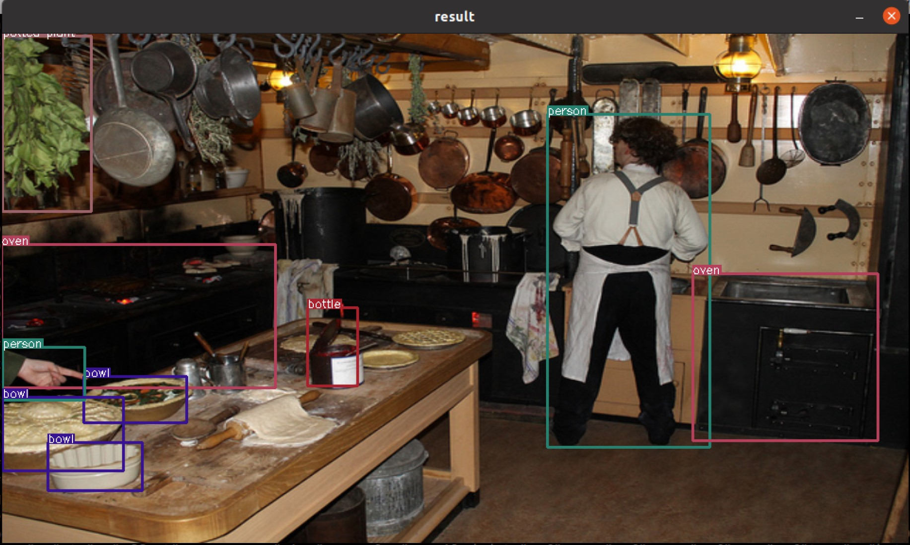
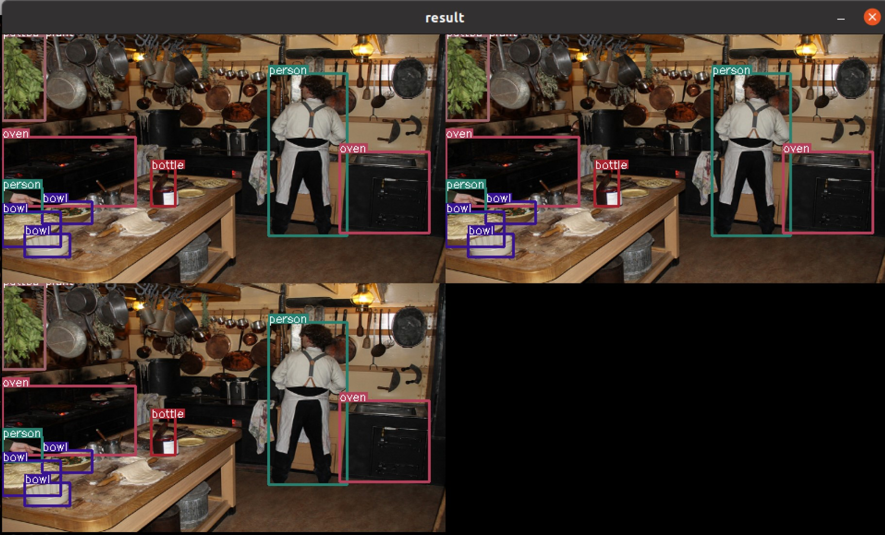
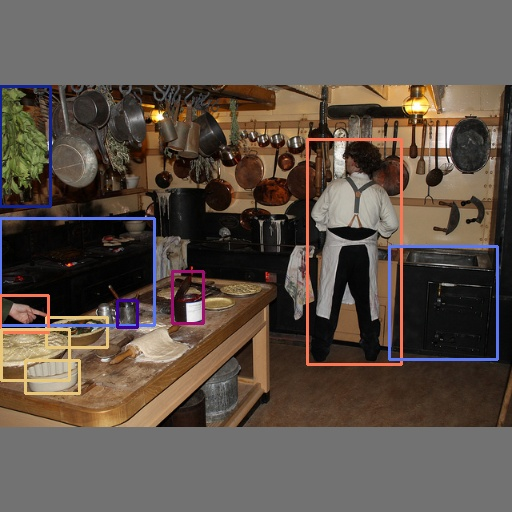

## DX-APP (DXNN V2)    

**DX-APP** is DEEPX User's Application Templates based on DEEPX devices.    
This is an application examples that gives you a quick experience of NPU Accelerator performance.     
You can refer to **DX-APP** and modify it a little or implement application depending on the purpose of your use.       
This can reduce stress, such as setting the environment and implementing the code.    
Application performance may also depending on the specifications of the host CPU because it includes pre/post processing and graphics processing operations.           


## C++ Application Templates     

Application Template is that makes it easy to experience classification or object detection through json config file modification.        
The only part that needs to be modified is json config file.       
If the yolo decoding method requires customization, you only need to modify the yoloCustomDecode part of [lib/utils/box_decode.hpp](../lib/utils/box_decode.hpp).    
Currently, This template only supports detection in the yolo method. 

### prerequisites    

- Set up build Environment ([Link](https://github.com/DEEPX-AI/dx_rt/blob/main/docs/Installation.md))     
- Install dxrt library and driver ([Link](https://github.com/DEEPX-AI/dx_rt/blob/main/docs/Getting-Started.md))     
- model compiled for DEEPX's NPU chips ([Link](https://deepx.ai/model-zoo/))   

You can also refer to the installation guide, [Here](../README.md#Installation)

### Build DX-APP    
- **Build Application**          
  ```shell
  ./build.sh 
  ```
  If you want a clean build, use the **--clean** option.          
  ```shell
  ./build.sh --clean
  ```
  To specify the compilation environment as arm64 or riscv64, use the **--arch** option.     
  ```shell
  ./build.sh --arch arm64
  # or
  # ./build.sh --arch riscv64
  ```            
  After the build is successfully completed, demo and templates will be installed on the <U>\<your dx-app path\>/bin/</U>.

    
## Run Application Temaplate     
**Getting the usage of executable, Try run with "-h" option.**
python example code is [here](#Run-ImageNet-Python-Example)

### Run Classification Template     
  - **Classification**       
    ```shell 
    $ ./bin/run_classifier -c example/imagenet_example.json
      ...
      [example/ILSVRC2012/0.jpeg] Top1 Result : class 831 (studio couch, day bed)
      [example/ILSVRC2012/1.jpeg] Top1 Result : class 321 (admiral)
      [example/ILSVRC2012/2.jpeg] Top1 Result : class 846 (table lamp)
      [example/ILSVRC2012/3.jpeg] Top1 Result : class 794 (shower curtain)
    ```             

    [This](../example/imagenet_example.json) is a json config file that can run the classification model. Referring to this, you can customizing input and output. 
    And You can modify it in the application section for displaying or save classification results.   

    ```json
      "application": {
          "description": "result of post-processing after inference, you can use \"save\" or \"realtime\" or \"none\"",
          "type": "save"
      }
    ```

    <p align="center">
      
    </p>

          
### Run Detection Template     
  - **Detection**        
    ```shell 
    $ ./bin/run_detector -c example/yolov5s3_example.json
      ...
      detected : 9
    ```             
    [This](../example/yolov5s3_example.json) is a json config file that can run the detection model. Referring to this, you can customizing input and output. 
    And You can modify it in the application section for displaying or save detection results.   

    ```json
      "application": {
          "description": "result of post-processing after inference, you can use \"save\" or \"realtime\" or \"none\"",
          "type": "realtime"
      }
    ```     

    <p align="center">
      
    </p>
    
    When using the yolo model, the post processing parameters can be modified to suit the use by referring to official yolov5 model. 
    And You can also modify classes information. 
    You don't have to revise only the json config file to recompile the code. 

    Please refer to follow json config file.      
    ```json
      "model":{
          "path":"/your-detection-model-path/graph.dxnn",
          "param":{
              "name":"yolov5s_512",
              "score_threshold":0.25,
              "iou_threshold":0.3,
              "last_activation":"sigmoid",
              "decoding_method":"yolo_basic",
              "box_format":"center",
              "layer":[
                  {
                  "name":"2", "stride": 8,
                  "anchor_width": [10, 16, 33],
                  "anchor_height": [13, 30, 23]
                  },
                  {
                  "name":"1", "stride": 16,
                  "anchor_width": [30, 62, 59],
                  "anchor_height": [61, 45, 119]
                  },
                  {
                  "name":"0", "stride": 32,
                  "anchor_width": [116, 156, 373],
                  "anchor_height": [90, 198, 326]
                  }
              ]
          }
      }
    ```

    And it supports multi-channel detection. 
    You can experience multi-channel detection in the form of a checkerboard by writing the image, video, and camera device path in the sources list of the input section.

    ```json
    "input":{
        "format":"RGB",
        "sources":[
                {
                    "type":"image", "path":"/your-sample-image-path/1.jpg"
                },
                {
                    "type":"video", "path":"/your-sample-video-path/1.mp4"
                },
                {
                    "type":"video", "path":"/your-sample-video-path/1.mp4", "frames":100
                },
                {
                    "type":"camera", "path":"/dev/video0"
                }
        ]
    },
    ```

    <p align="center">
      
    </p>

    And If you use a cutomized yolo model instead of the official yolo model, or If you don't use the basic yolo decoding method, 
    You have to write a decode function yourself. You can also refer to the yoloXDecode in the box_decode.hpp.
    Write your own decode function by analyzing the following code block.     

    ```c
      dxapp::common::BBox yoloCustomDecode(std::function<float(float)> activation, float* data, dxapp::common::Point grid, dxapp::common::Size anchor, int stride, float scale)
      {
          /**
           * @brief adding your decode method
           * 
           * example code ..
           * 
           *      dxapp::common::BBox box_temp;
           *      box_temp._xmin = (activation(data[0]) * 2. - 0.5 + grid._x ) * stride; //center x
           *      box_temp._ymin = (activation(data[1]) * 2. - 0.5 + grid._y ) * stride; //center y
           *      box_temp._width = std::pow((activation(data[2]) * 2.f), 2) * anchor._width;
           *      box_temp._height = std::pow((activation(data[3]) * 2.f), 2) * anchor._height;
           *      dxapp::common::BBox result = {
           *              ._xmin=box_temp._xmin - box_temp._width / 2.f,
           *              ._ymin=box_temp._ymin - box_temp._height / 2.f,
           *              ._xmax=box_temp._xmin + box_temp._width / 2.f,
           *              ._ymax=box_temp._ymin + box_temp._height / 2.f,
           *              ._width = box_temp._width,
           *              ._height = box_temp._height,
           *      };
           * 
           */
  
          dxapp::common::BBox result;
  
          return result;
      };
    ```
    
    As you know, if you modify the code, you have to re-compile it.    

    ```shell
    $ ./build.sh 
    ```

### Run ImageNet Python Example      
**Getting the usage of executable, Try run with "--help" option.**
  - **Classification**       
  ```shell 
  $ python template/python/imageNet_example.py
  ```             
  or      
  ```shell 
  $ python template/python/imageNet_example.py --config example/imagenet_example.json
    ...
    [example/ILSVRC2012/0.jpeg] Top1 Result : class 831 (studio couch, day bed)
    [example/ILSVRC2012/1.jpeg] Top1 Result : class 321 (admiral)
    [example/ILSVRC2012/2.jpeg] Top1 Result : class 846 (table lamp)
    [example/ILSVRC2012/3.jpeg] Top1 Result : class 794 (shower curtain)
    Profiler data has been written to profiler.json
    Task0 , npu_0 : latency 1848 us, inference time 1411.75 us
    Device 0 : 4
  ```     
  Import The InferenceEngine module which callable inference engine module.   
  ```python
    from dx_engine import InferenceEngine
  ```   
  Enter the model file as a parameter to **InferecneEngine** module.    
  ```python
    ie = InferenceEngine("./example/EfficientNetB0_4/graph.dxnn")
  ```   
  The dxrt model has input and output tensors that shapes are N H W C format by default. Output tensor data format of current devices is aligned on 64-byte.   
  You should refer to the [Here](python/imageNet_example.py) and re-arrange input data.     
  ```python
    def preprocessing(image, new_shape=(224, 224), align=64, format=None):
        image = cv2.resize(image, new_shape)
        h, w, c = image.shape
        if format is not None:
            image = cv2.cvtColor(image, format)
        if align == 0 :
            return image
        length = w * c
        align_factor = align - (length - (length & (-align)))
        image = np.reshape(image, (h, w * c))
        dummy = np.full([h, align_factor], 0, dtype=np.uint8)
        image_input = np.concatenate([image, dummy], axis=-1)
            
        return image_input
  ```

### Run YoloV5S Python Example      
**Getting the usage of executable, Try run with "--help" option.**
  - **Object Detection**       
  ```shell 
  $ python template/python/yolov5s.py
  ```             
  or      
  ```shell 
  $ python template/python/yolov5s.py --config example/yolov5s3_example.json
    ...
    [Result] Detected 10 Boxes.
    [0] conf, classID, x1, y1, x2, y2, : 0.8771, person(0), 307, 139, 401, 364
    [1] conf, classID, x1, y1, x2, y2, : 0.7358, bowl(45), 46, 317, 107, 347
    [2] conf, classID, x1, y1, x2, y2, : 0.7192, bowl(45), 25, 360, 79, 393
    [3] conf, classID, x1, y1, x2, y2, : 0.6766, oven(69), 0, 218, 154, 325
    [4] conf, classID, x1, y1, x2, y2, : 0.5811, oven(69), 389, 246, 497, 359
    [5] conf, classID, x1, y1, x2, y2, : 0.5664, person(0), 0, 295, 48, 332
    [6] conf, classID, x1, y1, x2, y2, : 0.5365, bowl(45), 1, 329, 69, 380
    [7] conf, classID, x1, y1, x2, y2, : 0.4199, potted plant(58), 0, 86, 50, 206
    [8] conf, classID, x1, y1, x2, y2, : 0.3649, bottle(39), 172, 271, 203, 323
    [9] conf, classID, x1, y1, x2, y2, : 0.3084, cup(41), 117, 300, 137, 327
    ...
  ```     
  After converting, You can easily cpu-post-processing using cpu_0.onnx output file with dxnn file.  
  Modify python application with reference to [templates/python/yolov5s_example.py](./python/yolov5s_example.py).   

  <p align="center">
    
  </p>

  Import The InferenceEngine module which callable inference engine module.   
  ```python
    from dx_engine import InferenceEngine
  ```   
  Enter the model file as a parameter to **InferecneEngine** module.    
  ```python
    ie = InferenceEngine("./example/YOLOV5S_3/graph.dxnn")
  ```   
  
  ```python
        image_src = cv2.imread(input_path, cv2.IMREAD_COLOR)
        image_input, _, _ = letter_box(image_src, new_shape=(512, 512), fill_color=(114, 114, 114), format=cv2.COLOR_BGR2RGB)
        
        ''' detect image (1) run dxrt inference engine, (2) run onnx session for decoding'''
        ie_output = ie.run(image_input)
        print("dxrt inference Done! ")
        input_dict = {input_names[0]:ie_output[0], input_names[1]:ie_output[1], input_names[2]:ie_output[2]}
        ort_output = sess.run(None, input_dict)
        print("cpu node inference Done! ")
        
        ''' post Processing '''
        conf_thres, iou_thres = 0.3, 0.4
        x = torch.Tensor(ort_output[0][0])
        x = x[x[..., 4] > conf_thres]
        box = ops.xywh2xyxy(x[:, :4])
        x[:, 5:] *= x[:, 4:5]
        conf, j = x[:, 5:].max(1, keepdims=True)
        x = torch.cat((box, conf, j.float()), 1)[conf.view(-1) > conf_thres]
        x = x[x[:, 4].argsort(descending=True)]
        x = x[torchvision.ops.nms(x[:,:4], x[:, 4], iou_threshold=iou_thres)]
        
        print("[Result] Detected {} Boxes.".format(len(x)))
        ''' result view '''
        image = cv2.cvtColor(image_input, cv2.COLOR_RGB2BGR)
        colors = np.random.randint(0, 256, [80, 3], np.uint8).tolist()
        for idx, r in enumerate(x.numpy()):
            pt1, pt2, conf, label = r[0:2].astype(int), r[2:4].astype(int), r[4], r[5].astype(int)
            print("[{}] conf, classID, x1, y1, x2, y2, : {:.4f}, {}({}), {}, {}, {}, {}"
                  .format(idx, conf, classes[label], label, pt1[0], pt1[1], pt2[0], pt2[1]))
            image = cv2.rectangle(image, pt1, pt2, colors[label], 2)
        cv2.imwrite("yolov5s.jpg", image)
  ```
